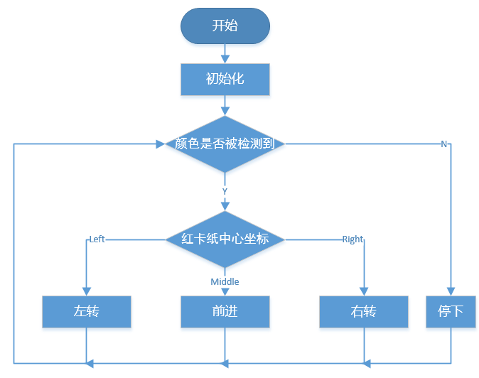

斗牛 — EzBlock
======================

让 PiCrawler 成为愤怒的公牛！用它的相机追踪功能来冲撞红布！

.. image:: img/bullfight.png

.. note:: 
    
    您可以下载并打印文件 :download:`PDF 颜色卡纸 <https://gitee.com/sunfounder/sf-pdf/raw/master/%E5%8D%A1%E7%89%87/%E7%9B%AE%E6%A0%87%E8%AF%86%E5%88%AB/%E9%A2%9C%E8%89%B2%E5%8D%A1.pdf>` 来用于颜色检测。

**程序**

打开示例后，可以看到如下积木块。

.. image:: img/sp210928_175806.png
    :width: 600

切换到远程控制界面，您将看到以下屏幕。

.. image:: img/sp21aa.png

**这个如何运作?**

总的来说，这个项目结合了 :ref:`移动 — EzBlock`, :ref:`计算机视觉 — EzBlock` 和 :ref:`音效 — EzBlock` 的知识点。

其流程图如下所示：

