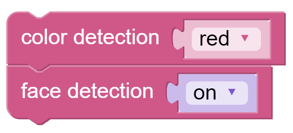
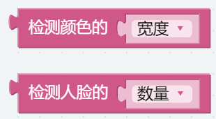

计算机视觉 — EzBlock
=============================

本项目将正式进入计算机视觉领域！

**程序**

打开示例后，可以看到如下积木块。

.. image:: media/sp210928_165255.png
    :width: 800

切换到远程控制界面，您将看到以下小部件。

.. image:: media/sp210928_165642.png

程序运行后，您可以切换开关A来开启/关闭人脸检测；点击方向盘A选择检测颜色；点击按钮A打印检测结果。

**这个如何运作?**

这个积木块用于启用相机模块。

这两个块用于启用人脸检测/颜色检测功能。

这两个块用于输出信息。检测结果会输出5个值，分别是坐标x值、坐标y值、宽度、高度和数量。

