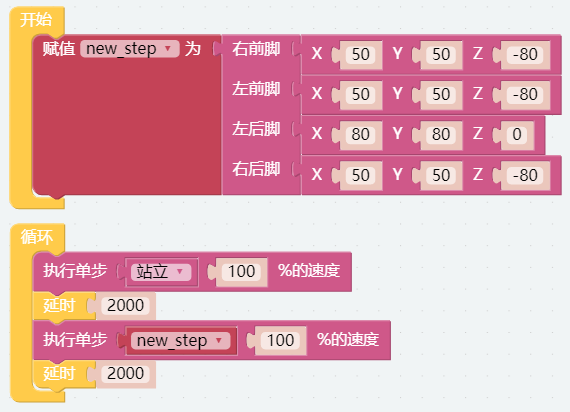

摆姿势 — EzBlock
====================

PiCrawler 可以通过写入坐标数组来呈现特定的姿势。在本项目让它摆出抬起的右后脚姿势。

.. image:: ../image/4cood.A.png

**程序**

打开示例后，可以看到如下积木块。

**这个如何运作?**

这段代码中，需要注意 **执行单步** 积木块。

它有两个用法:

一: 直接用下拉选项选择 **站立** 或者 **坐下**。

二: 接收一个自定义的变量，这个变量是一个数组，包含四个空间坐标。

PiCrawler每只脚都有一个独立的坐标系。如下所示：

.. image:: ../image/4cood.png

您需要单独测量每个脚趾的坐标。如下所示：

.. image:: ../image/1cood.png
