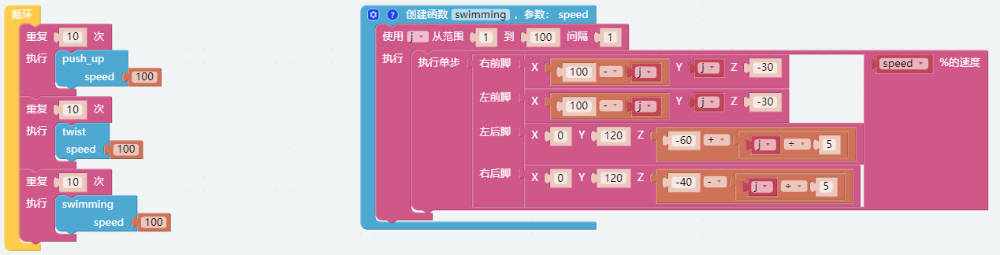

情感机器人 — EzBlock
==========================

这个例子展示了 PiCrawler 的几个有趣的自定义动作。

可以把这个项目当成 :ref:`组合动作 — EzBlock` 项目的补充。

**程序**

打开示例后，可以看到如下积木块。（点击图片可以放大）

.. image:: img/sp210928_173753.png
    :width: 800

