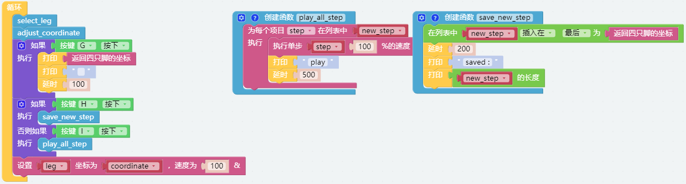

记录姿势
==============================

我们使用遥控功能控制 PiCrawler 依次摆出几个新的姿势，并记录下这些姿势。然后让 PiCrawler 重复这些姿势。

**程序**

.. note::

  你可以直接打开我们提供的示例或者是按照下图来编写程序，详细教程请参考 :ref:`open_create`。

.. image:: img/record.png
    :width: 800

程序运行后，切换到远程控制界面，您将看到以下小部件。

.. image:: img/sp210928_164343-1.png
    :width: 600

* 按钮A,B,C和D是用来选择不同的腿。
* 用E,F和方向盘用来调整每条腿的X,Y和Z坐标。
* 按键H来记录新动作，按键I来重复记录的动作。
* 将PiCrawler调整到自己想要的姿势后，按下按钮G来打印所有腿的坐标值。

**这个如何运作?**

这个项目可以参考之前的 :ref:`ezb_do_leg`。 我们在这里新增了记录和回放的功能。

记录功能由以下代码实现。

.. image:: img/sp210928_164449.png

回放功能由以下代码实现。

.. image:: img/sp210928_164500.png