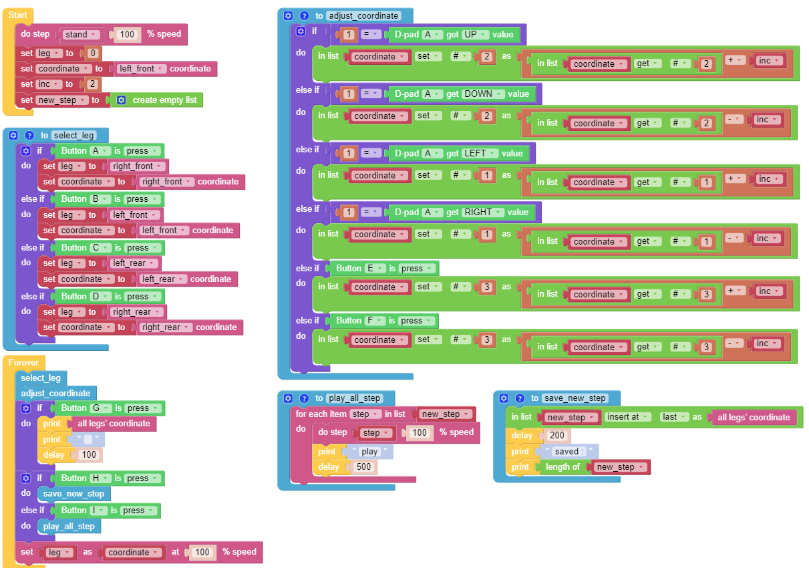
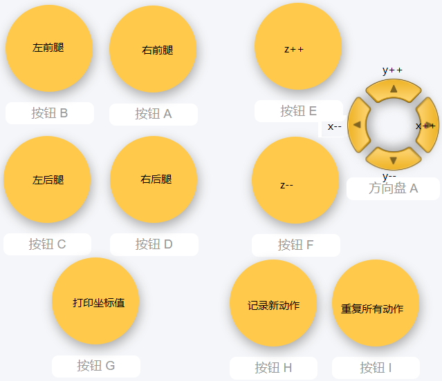
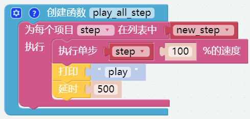

记录姿势 — EzBlock
==============================

我们使用遥控功能控制 PiCrawler 依次摆出几个新的姿势，并记录下这些姿势。然后让 PiCrawler 重复这些姿势。

**程序**

打开示例后，可以看到如下积木块。（点击图片可以放大）

.. image:: media/record2.png
    :width: 800    

切换到远程控制界面，您将看到以下小部件。

**这个如何运作?**

这个项目可以参考之前的 :ref:`调整姿势`。 我们在这里新增了记录和回放的功能。

记录功能由以下代码实现。

.. image:: media/sp210928_164449.png

回放功能由以下代码实现。

