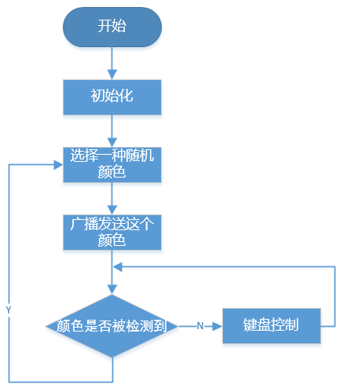

寻宝  — EzBlock
============================

在你的房间里布置一个迷宫，在六个角落放置六张不同颜色的卡片。然后控制PiCrawler一一搜索这些卡纸吧！

.. note:: 
    
    您可以下载并打印文件 :download:`PDF 颜色卡纸 <https://gitee.com/sunfounder/sf-pdf/raw/master/%E5%8D%A1%E7%89%87/%E7%9B%AE%E6%A0%87%E8%AF%86%E5%88%AB/%E9%A2%9C%E8%89%B2%E5%8D%A1.pdf>` 来用于颜色检测。

**程序**

打开示例后，可以看到如下积木块。（点击图片可以放大）

.. image:: img/sp210928_181036.png
    :width: 800

切换到远程控制界面，您将看到以下小部件。

.. image:: img/sp210928_181134.png
    :width: 800

**这个如何运作?**

总的来说，这个项目结合了 :ref:`远程控制 — EzBlock`, :ref:`计算机视觉 — EzBlock` 和 :ref:`音效 — EzBlock` 的知识点。

其流程图如下所示:

