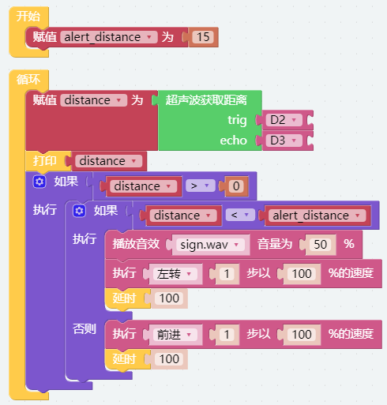
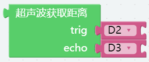

Obstacle Avoidance — Ezblock
=============================

In this project, picrawler will use an ultrasonic module to detect obstacles in front. 
When PiCrawler detects an obstacle, it will send a signal and look for another direction to move forward.

**Program**

After opening the example, you can see the following code block.

**How it works?**

You can find the following blocks in the **Module** category to achieve distance detection:

It should be noted that the two pins of the block should correspond to the actual wiring, that is, trig-D2, echo-D3.

Here is the main program.

* Read the ``distance`` detected by ultrasonic module and filter out the values less than 0 (When the ultrasonic module is too far from the obstacle or cannot read the data correctly, ``distance<0`` will appear).
* When the ``distance`` is less than ``alert_distance`` (the threshold value set earlier, which is 10), play the sound effect ``sign.wav``. PiCrawler does ``turn left`` .
* When the ``distance`` is greater than ``alert_distance``, PiCrawler will move ``forward``.
