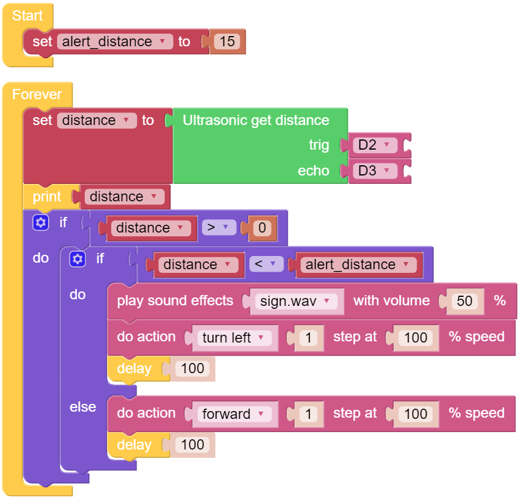
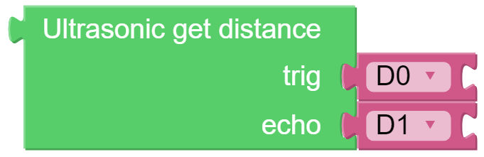

.. note:: 

    こんにちは、FacebookのSunFounder Raspberry Pi & Arduino & ESP32愛好者コミュニティへようこそ！Raspberry Pi、Arduino、ESP32について、他の愛好者と一緒にさらに深く学んでいきましょう。

    **なぜ参加するべきか？**

    - **専門家によるサポート**：購入後の問題や技術的な課題を、コミュニティやチームの支援を通じて解決できます。
    - **学びと共有**：スキルを向上させるためのヒントやチュートリアルを交換できます。
    - **限定プレビュー**：新製品の発表やプレビューをいち早く見ることができます。
    - **特別割引**：最新製品に対する専用割引を享受できます。
    - **季節のプロモーションとプレゼント企画**：プレゼント企画やホリデープロモーションに参加できます。

    👉 一緒に探求し、創造を楽しみたいですか？ [|link_sf_facebook|] をクリックして、今すぐ参加しましょう！

.. _ezb_avoid:

障害物回避
=============================

このプロジェクトでは、PiCrawlerが超音波モジュールを使用して前方の障害物を検出します。
PiCrawlerが障害物を検出すると、信号を送信し、別の方向に進むための道を探します。

.. .. image:: ../python/img/avoid1.png

**プログラム**

.. note::

    * 以下の画像に従ってプログラムを書くことができます。詳細なチュートリアルについては、:ref:`ezblock:create_project_latest` をご参照ください。
    * あるいは、EzBlock Studioの **Examples** ページで同名のコードを見つけて、 **実行** または **編集** を直接クリックすることができます。

**仕組みは？**

距離検出を実現するために、 **Module** カテゴリに次のブロックを使用します：

注意すべき点は、ブロックの2つのピンが実際の配線に対応していることです。つまり、trigはD2、echoはD3です。

以下はメインプログラムの概要です。

* 超音波モジュールで検出された ``distance`` を読み取り、0未満の値をフィルタリングします（超音波モジュールが障害物から遠すぎるか、データを正しく読み取れない場合、 ``distance<0`` が表示されます）。
* ``distance`` が ``alert_distance`` （以前設定したしきい値、10）未満の場合、効果音 ``sign.wav`` を再生します。PiCrawlerは ``左に回転`` します。
* ``distance`` が ``alert_distance`` より大きい場合、PiCrawlerは ``前進`` します。
