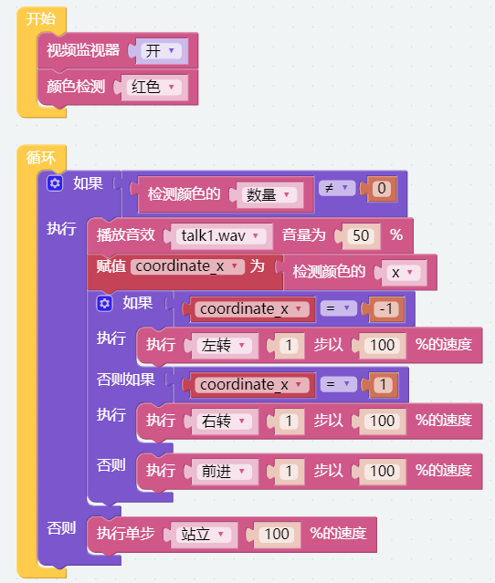
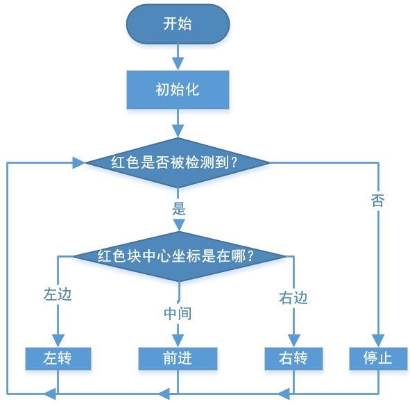

.. _ezb_bull:

斗牛游戏
======================

让 PiCrawler 变身成一头愤怒的公牛！利用摄像头追踪并冲向红布！

.. note:: 你可以下载并打印用于颜色检测的 :download:`PDF 色卡 <https://github.com/sunfounder/sf-pdf/raw/master/prop_card/object_detection/color-cards.pdf>` 。

**Program**

.. note::

    * 你可以根据下图编写程序，详细操作请参考教程：:ref:`ezblock:create_project_latest`。
    * 或者在 EzBlock Studio 的 **Examples** 页面找到同名示例代码，直接点击 **Run** 或 **Edit** 运行或修改。

切换到远程控制界面后，你将看到如下画面。

.. image:: img/sp21aa.png

**工作原理**

总体来说，本项目结合了 :ref:`ezb_move`、:ref:`ezb_vision` 和 :ref:`ezb_sound` 的相关知识点。

其执行流程如下图所示：

