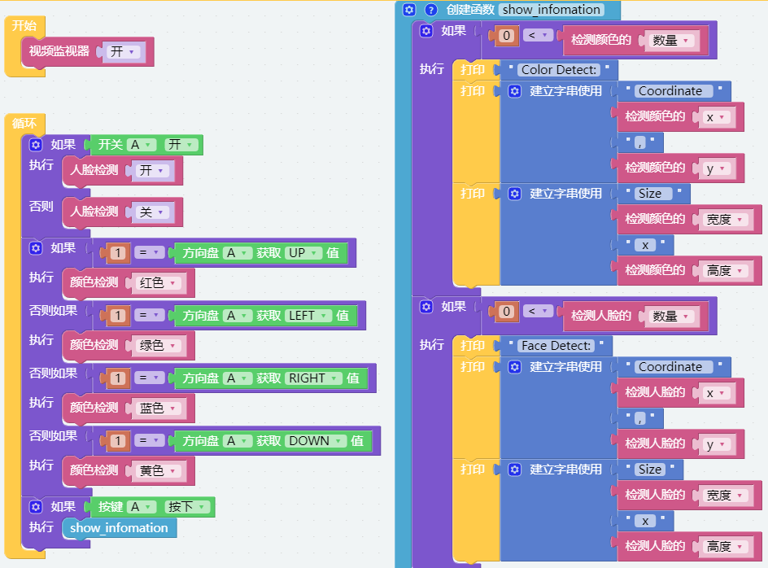
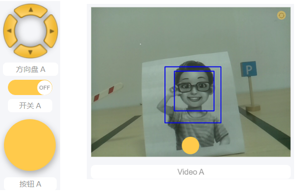
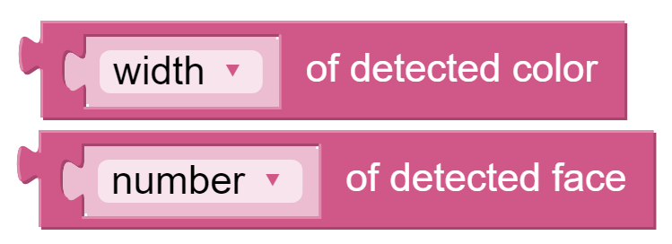

.. note:: 

    Bonjour, bienvenue dans la communauté des passionnés de Raspberry Pi, Arduino et ESP32 sur Facebook ! Explorez plus en profondeur Raspberry Pi, Arduino et ESP32 avec d'autres passionnés.

    **Pourquoi rejoindre ?**

    - **Support d'experts** : Résolvez vos problèmes après-vente et vos défis techniques avec l'aide de notre communauté et de notre équipe.
    - **Apprendre et partager** : Échangez des astuces et des tutoriels pour améliorer vos compétences.
    - **Aperçus exclusifs** : Accédez en avant-première aux annonces de nouveaux produits et bénéficiez de découvertes exclusives.
    - **Réductions spéciales** : Profitez de réductions exclusives sur nos produits les plus récents.
    - **Promotions festives et concours** : Participez à des concours et promotions pendant les fêtes.

    👉 Prêt à explorer et à créer avec nous ? Cliquez sur [|link_sf_facebook|] et rejoignez-nous dès aujourd'hui !

.. _ezb_vision:

Vision par ordinateur
=============================

Ce projet entre officiellement dans le domaine de la vision par ordinateur !

.. note:: 

    Vous pouvez consulter :ref:`ezblock:video_latest`. Venez réaliser ce projet sans encombre.

**Programme**

.. note:: 

    * Vous pouvez écrire le programme en suivant l'image ci-dessous, veuillez consulter le tutoriel : :ref:`ezblock:create_project_latest`.
    * Ou trouvez le code portant le même nom sur la page **Exemples** d'EzBlock Studio et cliquez directement sur **Exécuter** ou **Modifier**.

Passez à l'interface de contrôle à distance, vous verrez les widgets suivants.

Une fois le programme lancé, vous pouvez utiliser le widget de glissement pour activer/désactiver la détection faciale ; cliquez sur le D-Pad pour sélectionner la couleur de détection ; cliquez sur le bouton pour afficher le résultat de la détection.

**Comment ça fonctionne ?**

.. image:: img/sp210928_170920.png

Ce bloc permet d'activer le module caméra.

.. image:: img/sp210928_171021.png
    :width: 400

Ces deux blocs activent la fonction de détection faciale/détection de couleur.

Ces deux blocs permettent d'afficher les informations. Le résultat de la détection a cinq valeurs de sortie : la valeur des coordonnées x, la valeur des coordonnées y, la largeur, la hauteur et le nombre.
