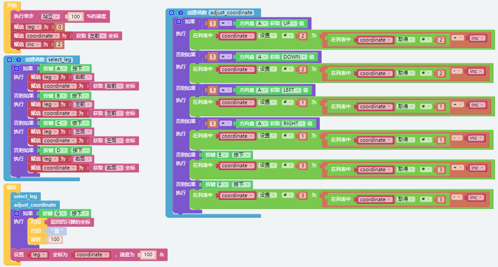
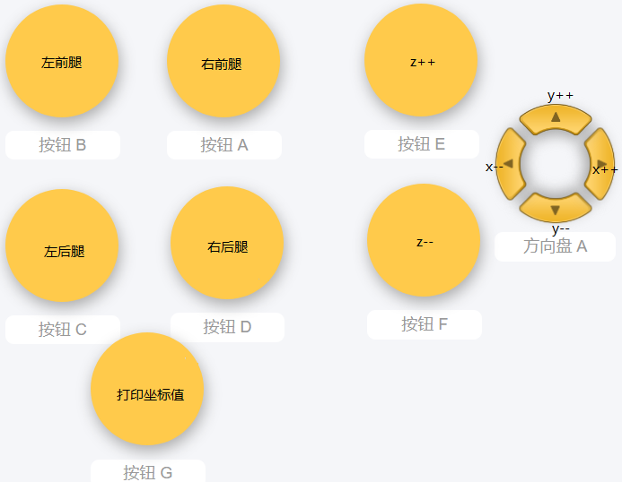
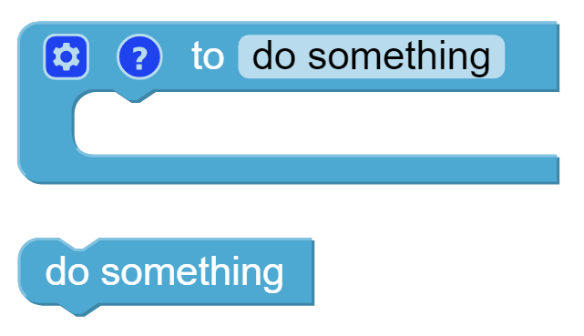

.. note:: 

    こんにちは、FacebookのSunFounder Raspberry Pi & Arduino & ESP32愛好者コミュニティへようこそ！Raspberry Pi、Arduino、ESP32について、他の愛好者と共にさらに深く学んでいきましょう。

    **なぜ参加するべきか？**

    - **専門家によるサポート**：購入後の問題や技術的な課題を、コミュニティやチームの支援を通じて解決できます。
    - **学びと共有**：スキルを向上させるためのヒントやチュートリアルを交換できます。
    - **限定プレビュー**：新製品の発表やプレビューをいち早く見ることができます。
    - **特別割引**：最新製品に対する専用割引を享受できます。
    - **季節のプロモーションとプレゼント企画**：プレゼント企画やホリデープロモーションに参加できます。

    👉 一緒に探求し、創造を楽しみたいですか？ [|link_sf_facebook|] をクリックして、今すぐ参加しましょう！

.. _ezb_posture:

姿勢の調整
==========================

この例では、リモート機能を使ってPiCrawlerの足を1本ずつ制御し、所定の姿勢を取らせます。

ボタンをタップすることで、現在の座標値を表示できます。これらの座標値は、PiCrawlerのユニークなアクションを作成する際に役立ちます。

.. image:: ../python/img/1cood.A.png

**プログラム**

.. note::

    * 以下の画像を参考にしてプログラムを書くことができます。詳細なチュートリアルについては、:ref:`ezblock:create_project_latest` をご参照ください。
    * または、EzBlock Studioの **Examples** ページで同名のコードを見つけ、 **実行** または **編集** をクリックすることができます。

リモートコントロールインターフェースに切り替えると、以下のウィジェットが表示されます。

**仕組みは？**

このプロジェクトで注意すべき3つのブロックは次の通りです：

.. image:: img/sp210928_115847.png

特定の足の座標値を個別に変更します。

対応する足の座標値を返します。

同じ操作を複数回実行する場合、プログラムを簡略化するために関数を使用することをお勧めします。
これらの操作を新しく宣言した関数にまとめることで、使用が非常に簡単になります。

