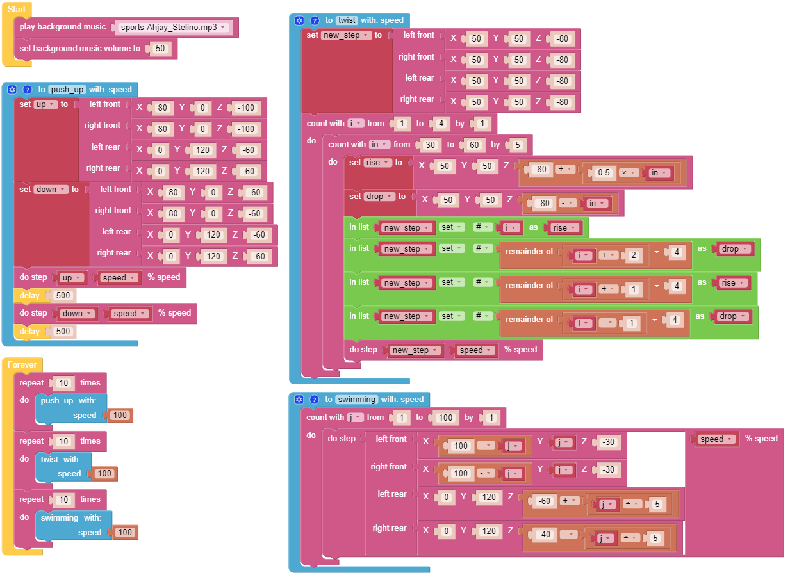

.. _ezb_emotional:

情感机器人
==========================

本示例展示了 PiCrawler 的一些有趣自定义动作。  

它是 :ref:`ezb_twist` 的补充示例。

**Program**

.. note::

    * 你可以根据下图编写程序，详细操作请参考教程：:ref:`ezblock:create_project_latest`。
    * 或者在 EzBlock Studio 的 **Examples** 页面找到同名示例代码，直接点击 **Run** 或 **Edit** 运行或修改。

