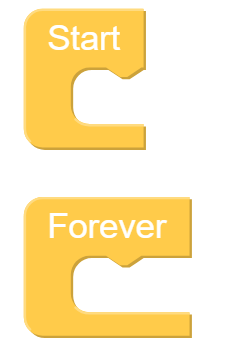

.. _ezb_move:

Move
=================

This is PiCrawler's first project. Perform its most basic function - move.

.. image:: ../python/img/move.png

**Program**

.. note::

    * You can write the program according to the following picture, please refer to the tutorial: :ref:`ezblock:create_project_latest`.
    * Or find the code with the same name on the **Examples** page of the EzBlock Studio and click **Run** or **Edit** directly.

.. image:: img/move.png

Click the Upload & Run button at the bottom right of the screen, and PiCrawler will execute "forward" and "backward" actions in sequence.

**How it works?**

First, you need to understand the program framework of Ezblock. as follows:

All Ezblock projects contain these two blocks. The **Start** block runs at the beginning of the program and is executed only once, and is often used to set variables; the **Forever** block runs after **Start**, and will be executed repeatedly, and is often used to implement main functions.
If you delete these two blocks, you can drag them back from the **Basic** category on the left.

Next you need to understand the following blocks.

**do action** allows PiCrawler to perform basic actions. You can modify the options in the first groove. For example, select "Turn Left", "Back" and so on.
The second groove can set the number of executions of the action, and only integer numbers greater than 0 can be written.
The third groove can set the speed of the action, and only integers within 0~100 can be written.

.. image:: img/sp210927_170717.png
    :width: 500

**do step** is similar to **do action**, but it is not an action but a static posture. Such as "stand", "sit".

Both blocks can be dragged from the **PiCrawler** category on the left.