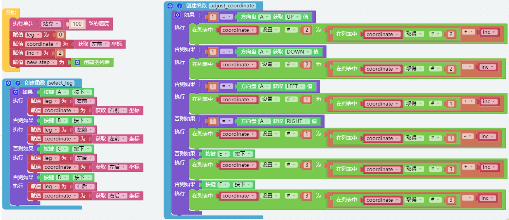
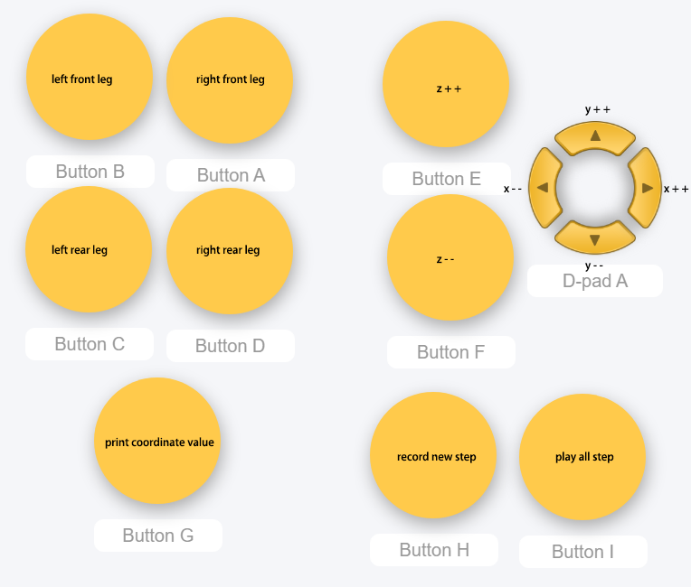
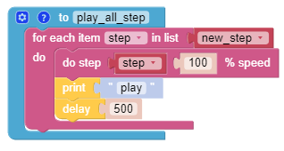

.. note:: 

    こんにちは、FacebookのSunFounder Raspberry Pi & Arduino & ESP32愛好者コミュニティへようこそ！Raspberry Pi、Arduino、ESP32について、他の愛好者と共にさらに深く学んでいきましょう。

    **なぜ参加するべきか？**

    - **専門家によるサポート**：購入後の問題や技術的な課題を、コミュニティやチームの支援を通じて解決できます。
    - **学びと共有**：スキルを向上させるためのヒントやチュートリアルを交換できます。
    - **限定プレビュー**：新製品の発表やプレビューをいち早く見ることができます。
    - **特別割引**：最新製品に対する専用割引を享受できます。
    - **季節のプロモーションとプレゼント企画**：プレゼント企画やホリデープロモーションに参加できます。

    👉 一緒に探求し、創造を楽しみたいですか？ [|link_sf_facebook|] をクリックして、今すぐ参加しましょう！

.. _ezb_record:

新しいステップを記録
==============================

このプロジェクトでは、リモート機能を使ってPiCrawlerを操作し、いくつかのポーズを順番に取らせ、それらのポーズを記録します。後で再生することができます。

**プログラム**

.. note::

    * 以下の画像を参考にしてプログラムを書くことができます。詳細なチュートリアルについては、:ref:`ezblock:create_project_latest` をご参照ください。
    * または、EzBlock Studioの **Examples** ページで同名のコードを見つけ、 **実行** または **編集** をクリックすることができます。

リモートコントロールインターフェースに切り替えると、次のウィジェットが表示されます。

**動作の仕組み**

このプロジェクトは、:ref:`ezb_posture` から派生したもので、記録および再生機能が追加されています。

記録機能は次のコードによって実装されています。

.. image:: img/sp210928_164449.png

再生機能は次のコードによって実装されています。

