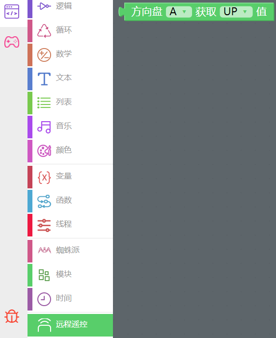
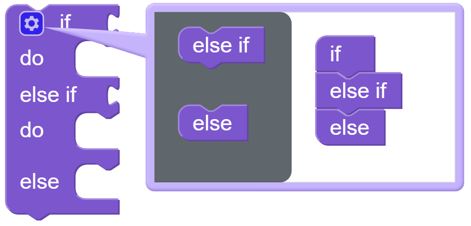

.. note::

    Hallo, willkommen in der SunFounder Raspberry Pi & Arduino & ESP32 Enthusiasten-Community auf Facebook! Tauchen Sie gemeinsam mit anderen Enthusiasten tiefer in die Welt von Raspberry Pi, Arduino und ESP32 ein.  

    **Warum beitreten?**  

    - **Expertenunterstützung**: Lösen Sie Probleme nach dem Kauf und bewältigen Sie technische Herausforderungen mit der Hilfe unserer Community und unseres Teams.  
    - **Lernen & Teilen**: Tauschen Sie Tipps und Tutorials aus, um Ihre Fähigkeiten zu erweitern.  
    - **Exklusive Vorschauen**: Erhalten Sie frühzeitigen Zugang zu neuen Produktankündigungen und exklusiven Einblicken.  
    - **Spezielle Rabatte**: Profitieren Sie von exklusiven Angeboten für unsere neuesten Produkte.  
    - **Festliche Aktionen und Gewinnspiele**: Nehmen Sie an Verlosungen und saisonalen Aktionen teil.  

    👉 Bereit, mit uns zu entdecken und zu gestalten? Klicken Sie auf [|link_sf_facebook|] und treten Sie noch heute bei!  

.. _ezb_remote:  

Fernsteuerung  
=========================

In diesem Projekt lernen wir, wie man PiCrawler fernsteuert.  
Sie können PiCrawler steuern, um vorwärts, rückwärts, nach links und nach rechts zu bewegen.  

.. image:: img/remote_control.png  

.. note:: 

    Sie können :ref:`ezblock:remote_control_latest` konsultieren, um dieses Projekt erfolgreich durchzuführen.  

**Programm**  

.. note::

    * Sie können das Programm gemäß der folgenden Abbildung schreiben. Bitte folgen Sie dem Tutorial: :ref:`ezblock:create_project_latest`.  
    * Oder suchen Sie den gleichnamigen Code auf der **Beispiele**-Seite von EzBlock Studio und klicken Sie direkt auf **Ausführen** oder **Bearbeiten**.  

.. image:: img/remote.png  

Wechseln Sie zur Fernsteuerungsschnittstelle, und Sie sehen die folgenden Widgets.  

.. image:: img/remote_B.png  

Nach dem Start des Programms können Sie PiCrawler über das Steuerkreuz (D-Pad) aktivieren.  

**Wie funktioniert es?**  

Nachdem Sie das Widget in der Fernsteuerungsschnittstelle hinzugefügt haben, erscheint eine Kategorie namens **Remote** in der Blockkategorien-Spalte der Programmierschnittstelle.  

Hier fügen wir das D-Pad-Widget hinzu, sodass der **D-Pad get value**-Block hier verfügbar ist.  

Das D-Pad kann als eine Vier-in-Eins-Taste betrachtet werden. Sie können in der zweiten Aussparung des Blocks auswählen, welche Taste gelesen werden soll.  

Wenn die Taste gedrückt wird, ist der Wert „1“; wenn die Taste nicht gedrückt wird, ist der Wert „0“.  

Wir haben einen **if**-Block verwendet (diesen finden Sie in der Kategorie **Logik** auf der linken Seite), um PiCrawler einmal vorwärts zu bewegen, wenn die **UP**-Taste des D-Pads gedrückt wird.  

Sie können auf das Zahnrad-Symbol oben links im Block klicken, um die Form des **if**-Blocks zu ändern und mehrere Verzweigungsabfragen zu realisieren.  

.. image:: img/sp210927_183237.png  
    :width: 300  

Der **if**-Block wird normalerweise zusammen mit dem **=**-Block verwendet. Der **=**-Block kann über das Dropdown-Menü in **>**, **<** oder andere Bedingungen geändert werden. Bitte verwenden Sie ihn flexibel.  
