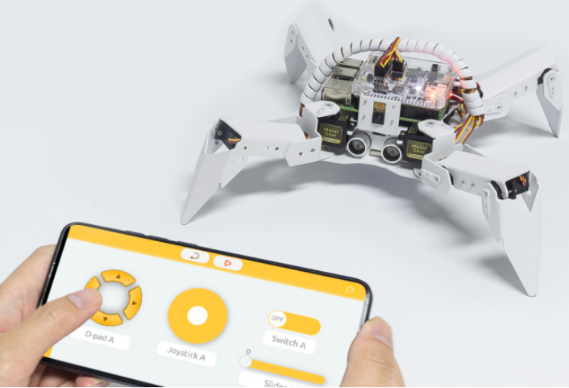
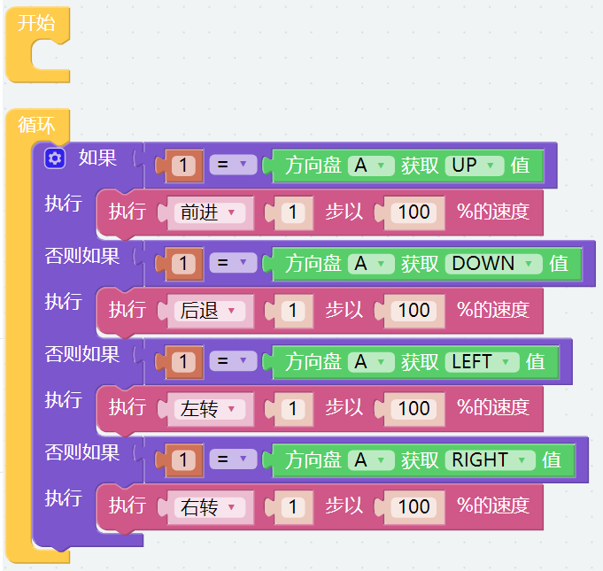
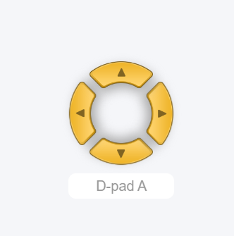
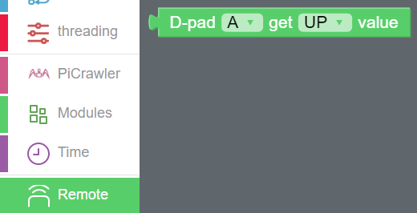

Remote Control — Ezblock
=========================

In this project, we will learn how to remote control the PiCrawler. 
You can control the PiCrawler to move forward, backward, left, and right.

.. note:: 

    You can refer to `How to Use the Remote Control Function? <https://docs.sunfounder.com/projects/ezblock3/en/latest/remote.html>`_. Come and carry out this project smoothly.

**Program**

After opening the example, you can see the following code block.

Switch to the Remote Control interface, and you will see the following widgets.

After the program is running, you can activate PiCrawler through D-Pad.

**How it works?**

After dragging out the widget on the Remote Control interface, a category named **Remote** will appear in the block categories column of the programming interface.

Here we add the D-Pad widget, so the **D-Pad get value** block appears here.

D-Pad can be regarded as a four-in-one button. You can choose which button to read in the second groove of the block.

When the button is pressed, the value is "1"; when the button is not pressed, the value is "0".

.. image:: media/sp210927_182447.png
    :width: 200

We used an **if** block (you can find it in the **Logic** category on the left) to make the PiCrawler move forward once when the **UP** button of the D-pad is pressed.

.. image:: media/sp210927_182828.png
    :width: 600

You can click the gear icon on the upper left of the block to modify the shape of the **if** block to realize multiple judgment branches.

**if** block is usually used with **=** block, **=** block can be modified to **>**, **<** and other conditions through the drop-down menu, please use it flexibly.
