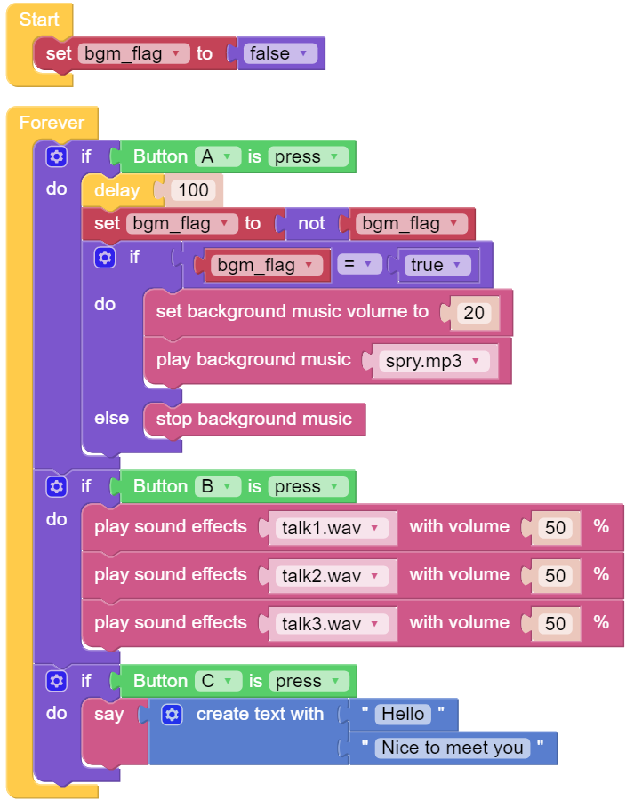
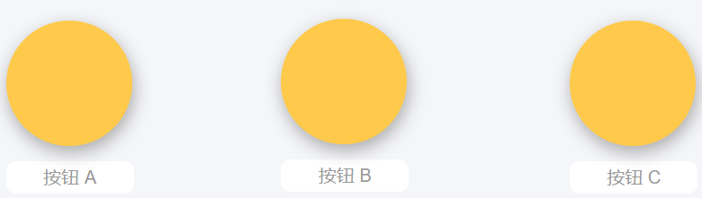
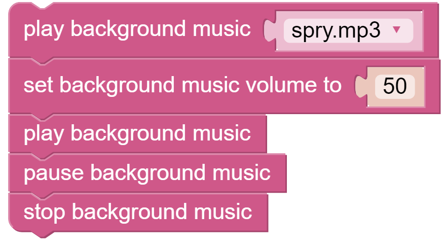

.. note::

    Hallo, willkommen in der SunFounder Raspberry Pi & Arduino & ESP32 Enthusiasten-Community auf Facebook! Tauchen Sie gemeinsam mit anderen Enthusiasten tiefer in die Welt von Raspberry Pi, Arduino und ESP32 ein.  

    **Warum beitreten?**  

    - **Expertenunterstützung**: Lösen Sie Probleme nach dem Kauf und bewältigen Sie technische Herausforderungen mit der Hilfe unserer Community und unseres Teams.  
    - **Lernen & Teilen**: Tauschen Sie Tipps und Tutorials aus, um Ihre Fähigkeiten zu erweitern.  
    - **Exklusive Vorschauen**: Erhalten Sie frühzeitigen Zugang zu neuen Produktankündigungen und exklusiven Einblicken.  
    - **Spezielle Rabatte**: Profitieren Sie von exklusiven Angeboten für unsere neuesten Produkte.  
    - **Festliche Aktionen und Gewinnspiele**: Nehmen Sie an Verlosungen und saisonalen Aktionen teil.  

    👉 Bereit, mit uns zu entdecken und zu gestalten? Klicken Sie auf [|link_sf_facebook|] und treten Sie noch heute bei!  

.. _ezb_sound:  

Soundeffekte  
=======================

In diesem Beispiel verwenden wir die Soundeffekte von PiCrawler (genauer gesagt, des Robot HAT). Sie bestehen aus drei Teilen: **Musik**, **Sound** und **Text-to-Speech**.  

.. .. image:: ../python/img/tts.png  

**Programm**  

.. note::

    * Sie können das Programm gemäß der folgenden Abbildung schreiben. Bitte folgen Sie dem Tutorial: :ref:`ezblock:create_project_latest`.  
    * Oder suchen Sie den gleichnamigen Code auf der **Beispiele**-Seite von EzBlock Studio und klicken Sie direkt auf **Ausführen** oder **Bearbeiten**.  

Wechseln Sie zur Fernsteuerungsschnittstelle, und Sie sehen die folgenden Widgets.  

Nach dem Start des Programms können Sie verschiedene Tasten drücken, um PiCrawler Geräusche erzeugen zu lassen.  

**Wie funktioniert es?**  

Funktionen im Zusammenhang mit Hintergrundmusik umfassen:  

Funktionen im Zusammenhang mit Soundeffekten umfassen:  

Funktionen im Zusammenhang mit Text-to-Speech umfassen:  

.. image:: img/sp210928_101609.png  