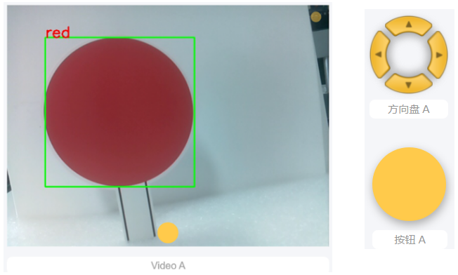

.. note::

    Ciao, benvenuto nella Community di SunFounder Raspberry Pi & Arduino & ESP32 su Facebook! Approfondisci il mondo di Raspberry Pi, Arduino ed ESP32 con altri appassionati.

    **Perché unirti a noi?**

    - **Supporto esperto**: Risolvi problemi post-vendita e sfide tecniche con l'aiuto della nostra community e del nostro team.
    - **Impara e condividi**: Scambia consigli e tutorial per migliorare le tue competenze.
    - **Anteprime esclusive**: Ottieni accesso anticipato agli annunci di nuovi prodotti e alle anteprime.
    - **Sconti speciali**: Approfitta di sconti esclusivi sui nostri prodotti più recenti.
    - **Promozioni festive e omaggi**: Partecipa a omaggi e promozioni festive.

    👉 Sei pronto per esplorare e creare con noi? Clicca su [|link_sf_facebook|] e unisciti oggi stesso!

.. _ezb_treasure:

Caccia al Tesoro
============================

Organizza un labirinto nella tua stanza e posiziona sei carte di colore diverso in sei angoli. Quindi controlla PiCrawler per cercare queste carte una per una!

.. note:: Puoi scaricare e stampare le :download:`Carte Colorate in PDF <https://github.com/sunfounder/sf-pdf/raw/master/prop_card/object_detection/color-cards.pdf>` per il rilevamento dei colori.

**Programma**

.. note::

    * Puoi scrivere il programma seguendo l'immagine sottostante, facendo riferimento al tutorial: :ref:`ezblock:create_project_latest`.
    * Oppure trova il codice con lo stesso nome nella pagina **Esempi** di EzBlock Studio e clicca direttamente su **Esegui** o **Modifica**.

.. image:: img/sp210928_181036.png
    :width: 800

Passa all'interfaccia di Controllo Remoto e vedrai i seguenti widget.

**Come funziona?**

In generale, questo progetto combina i punti di conoscenza di :ref:`ezb_remote`, :ref:`ezb_vision` e :ref:`ezb_sound`.

Il suo flusso è mostrato nella figura seguente:

.. image:: ../python/img/treasure_hunt-f.png
    :width: 600