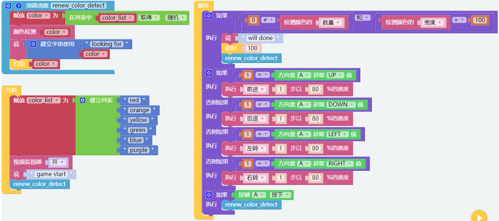
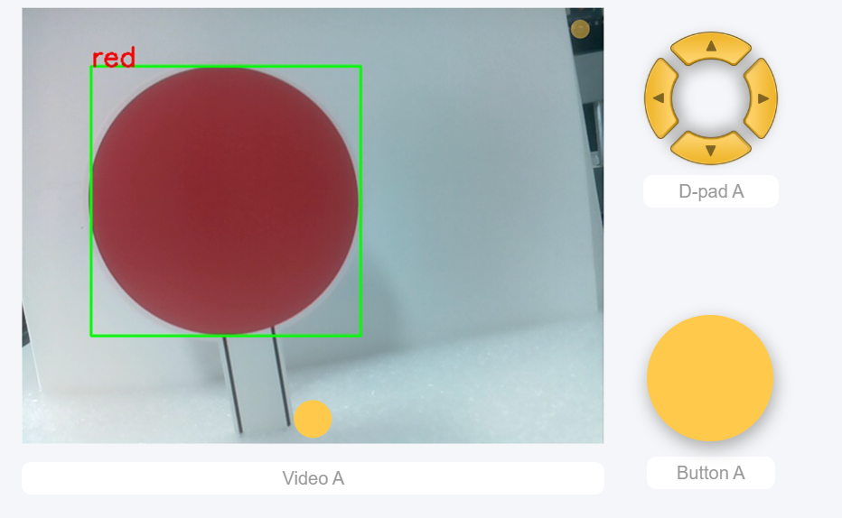

Treasure Hunt — Ezblock
============================

Arrange a maze in your room and place six different color cards in six corners. Then control PiCrawler to search for these color cards one by one!

.. note:: You can download and print the :download:`PDF Color Cards <https://github.com/sunfounder/sf-pdf/raw/master/prop_card/object_detection/color-cards.pdf>` for color detection.

**Program**

After opening the example, you can see the following code block.

Switch to the Remote Control interface, and you will see the following widgets.

**How it works?**

In general, this project combines the knowledge points of :ref:`Remote Control — Ezblock`, :ref:`Computer Vision — Ezblock` and :ref:`Sound Effect — Ezblock`.

Its flow is shown in the figure below:

.. image:: ../image/treasure_hunt-f.png
    :width: 600