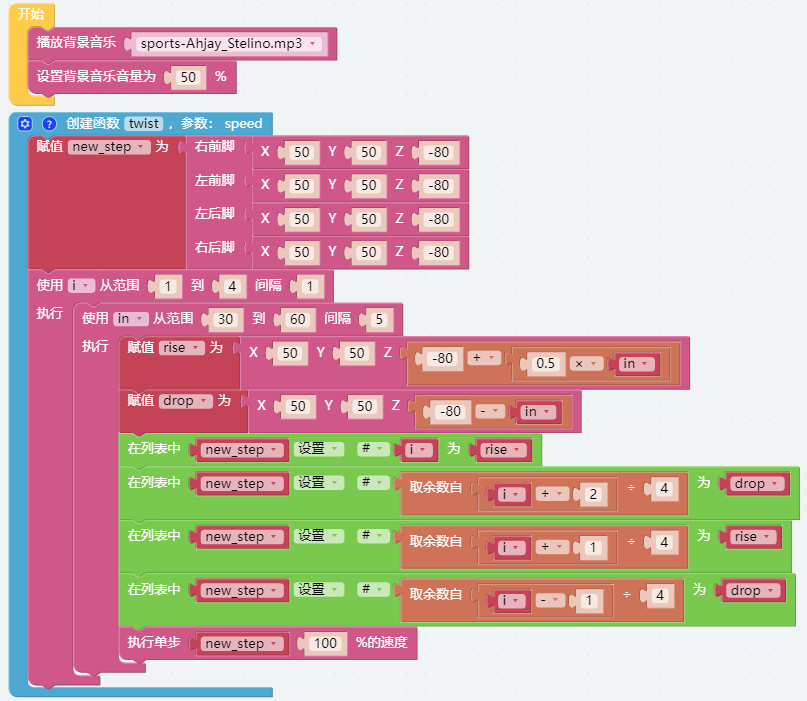
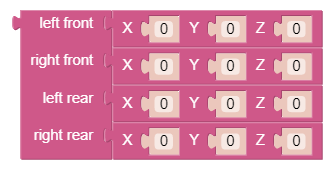

.. _ezb_twist:

扭动 
==================

我们已经学会了让 PiCrawler 摆出特定姿态，下一步就是将这些姿态组合起来，形成连续的动作。

在这里，PiCrawler 的四条腿两两交替上下抬动，随着音乐一起跳动。

**Program**

.. note::

    * 你可以根据下图编写程序，详细操作请参考教程：:ref:`ezblock:create_project_latest`。
    * 或者在 EzBlock Studio 的 **Examples** 页面找到同名示例代码，直接点击 **Run** 或 **Edit** 运行或修改。

**工作原理**

这里通过两层 for 循环，让 ``new_step`` 数组产生连续且有规律的变化，同时由 **do step** 执行相应的姿态，从而形成连贯的动作。

你可以在 :ref:`ezb_posture` 中直观地获取每个姿态对应的坐标数组。

需要特别注意的是这个坐标矩阵模块：

    
它本质上是一个二维数组，可以通过 **List** 分类中的模块进行处理。其结构为 ``[[right front],[left front],[left rear],[right rear]]`` 。  
换句话说，在此示例中： ``new_step#1`` 对应右前腿； ``new_step#2`` 对应左前腿； ``new_step#3`` 对应左后腿； ``new_step#4`` 对应右后腿。