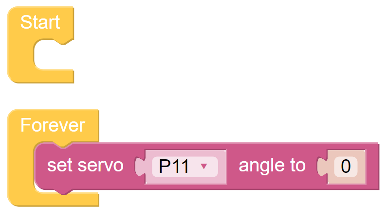
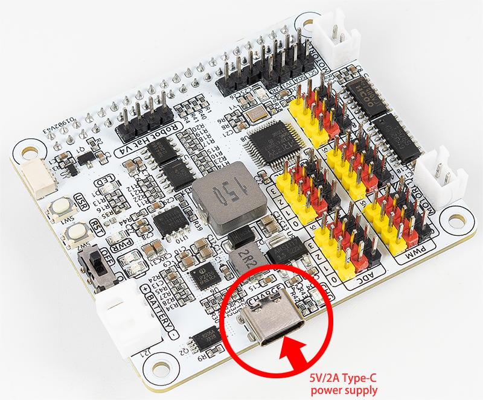

.. note:: 

    Ciao, benvenuto nella Community SunFounder Raspberry Pi & Arduino & ESP32 su Facebook! Esplora a fondo Raspberry Pi, Arduino ed ESP32 insieme ad altri appassionati.

    **Perché unirti a noi?**

    - **Supporto esperto**: Risolvi problemi post-vendita e sfide tecniche con l'aiuto della nostra community e del nostro team.
    - **Impara e condividi**: Scambia suggerimenti e tutorial per migliorare le tue competenze.
    - **Anteprime esclusive**: Accedi in anteprima agli annunci di nuovi prodotti.
    - **Sconti speciali**: Approfitta di sconti esclusivi sui nostri prodotti più recenti.
    - **Promozioni festive e giveaway**: Partecipa a concorsi e promozioni speciali.

    👉 Sei pronto a esplorare e creare con noi? Clicca [|link_sf_facebook|] e unisciti subito!

FAQ
===========================

Q1: Dopo aver installato Ezblock OS, il servo non può girare a 0°?
----------------------------------------------------------------------

1) Verifica che il cavo del servo sia collegato correttamente e che l'alimentazione del Robot HAT sia accesa.
2) Premi il pulsante di reset.
3) Se hai già eseguito il programma in Ezblock Studio, il programma personalizzato per P11 non è più disponibile. Puoi fare riferimento all'immagine qui sotto per scrivere manualmente un programma in Ezblock Studio per impostare l'angolo del servo a 0.

Q2: Usando VNC, mi viene detto che il desktop non può essere visualizzato al momento?
--------------------------------------------------------------------------------------

Nel terminale, digita ``sudo raspi-config`` per modificare la risoluzione.

Q3: Perché a volte il servo ritorna alla posizione centrale senza motivo?
-------------------------------------------------------------------------------

Quando il servo è bloccato da una struttura o un altro oggetto e non può raggiungere la posizione desiderata, entrerà in modalità di protezione dallo spegnimento per evitare di essere danneggiato da una corrente eccessiva.

Dopo un periodo di interruzione dell'alimentazione, se non viene dato alcun segnale PWM al servo, questo tornerà automaticamente alla sua posizione originale.

Q4: Dove posso trovare il tutorial dettagliato sul Robot HAT?
----------------------------------------------------------------

Puoi trovare un tutorial completo sul Robot HAT qui, incluse informazioni sul suo hardware e API.

* |link_robot_hat|

Q5: Informazioni sul caricabatterie
-------------------------------------------------------------------

Per caricare la batteria, collega semplicemente un alimentatore Type-C da 5V/2A alla porta di alimentazione del Robot Hat. Non è necessario accendere l'interruttore di alimentazione del Robot Hat durante la ricarica.
Puoi anche utilizzare il dispositivo mentre la batteria è in carica.

Durante la ricarica, l'energia in ingresso viene amplificata dal chip di ricarica per caricare la batteria e contemporaneamente alimentare il convertitore DC-DC per uso esterno, con una potenza di ricarica di circa 10W.
Se il consumo di energia esterna rimane elevato per un periodo prolungato, la batteria potrebbe integrare l'alimentazione, in modo simile all'uso di un telefono mentre è in carica. Tuttavia, fai attenzione alla capacità della batteria per evitare che si esaurisca completamente durante l'uso e la ricarica simultanei.
