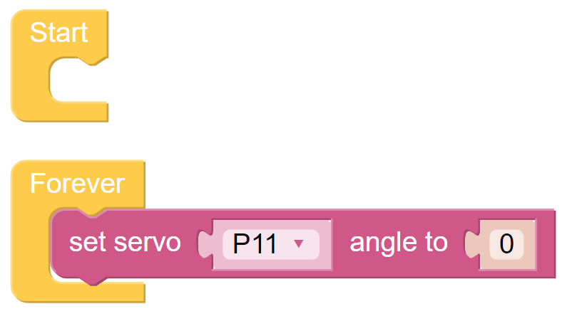
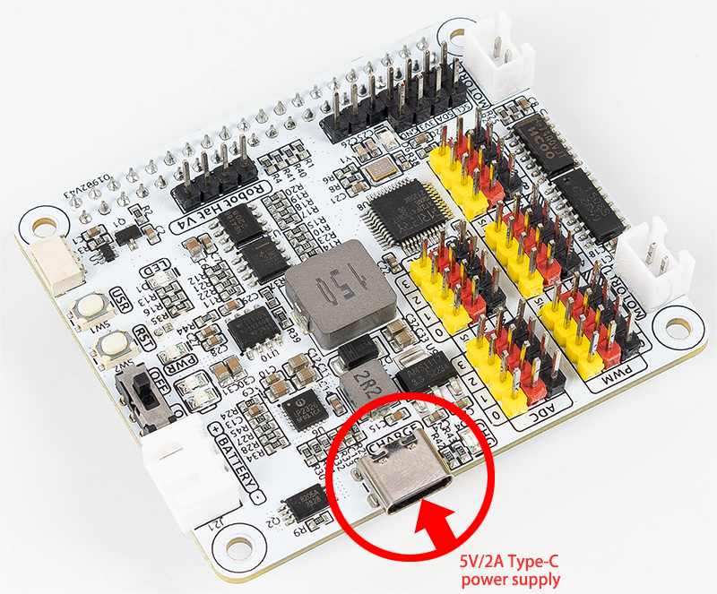

.. note:: 

    Bonjour, bienvenue dans la communauté des passionnés de Raspberry Pi, Arduino et ESP32 sur Facebook ! Explorez plus en profondeur l'univers du Raspberry Pi, de l'Arduino et de l'ESP32 avec d'autres passionnés.

    **Pourquoi rejoindre ?**

    - **Support d'experts** : Résolvez les problèmes post-vente et les défis techniques avec l'aide de notre communauté et de notre équipe.
    - **Apprendre et partager** : Échangez des astuces et des tutoriels pour améliorer vos compétences.
    - **Aperçus exclusifs** : Bénéficiez d'un accès anticipé aux annonces de nouveaux produits et d'aperçus exclusifs.
    - **Réductions spéciales** : Profitez de remises exclusives sur nos produits les plus récents.
    - **Promotions festives et concours** : Participez à des concours et à des promotions spéciales.

    👉 Prêt à explorer et à créer avec nous ? Cliquez sur [|link_sf_facebook|] et rejoignez-nous dès aujourd'hui !

FAQ
===========================

Q1 : Après avoir installé Ezblock OS, le servo ne tourne pas à 0° ?
----------------------------------------------------------------------

1) Vérifiez si le câble du servo est correctement connecté et si l'alimentation de la Robot HAT est activée.
2) Appuyez sur le bouton de réinitialisation.
3) Si vous avez déjà exécuté un programme dans Ezblock Studio, le programme personnalisé pour le P11 n'est plus disponible. Vous pouvez vous référer à l'image ci-dessous pour écrire manuellement un programme dans Ezblock Studio afin de définir l'angle du servo à 0.

Q2 : Lorsque j'utilise VNC, un message indique que le bureau ne peut pas être affiché pour le moment ?
------------------------------------------------------------------------------------------------------------

Dans le terminal, tapez ``sudo raspi-config`` pour modifier la résolution.

Q3 : Pourquoi le servo revient-il parfois à la position centrale sans raison apparente ?
---------------------------------------------------------------------------------------------

Lorsque le servo est bloqué par une structure ou un autre objet et ne peut pas atteindre sa position prévue, il entre en mode de protection par coupure d'alimentation afin d'éviter d'endommager le servo par un excès de courant.

Après une coupure de courant, si aucun signal PWM n'est envoyé au servo, celui-ci reviendra automatiquement à sa position d'origine.

Q4 : Où trouver un tutoriel détaillé sur la Robot HAT ?
----------------------------------------------------------

Vous pouvez consulter un tutoriel complet sur la Robot HAT ici, comprenant des informations sur son matériel et son API.

* |link_robot_hat|

Q5 : À propos du chargeur de batterie
-------------------------------------------------------------------

Pour charger la batterie, il suffit de connecter une alimentation Type-C de 5V/2A au port d'alimentation du Robot Hat. Il n'est pas nécessaire d'allumer l'interrupteur d'alimentation du Robot Hat pendant le chargement.
Vous pouvez également utiliser l'appareil pendant la charge de la batterie.

Pendant la charge, la puissance d'entrée est amplifiée par la puce de charge pour recharger la batterie tout en alimentant simultanément le convertisseur DC-DC pour un usage externe. La puissance de charge est d'environ 10 W.
Si la consommation électrique externe reste élevée sur une longue période, la batterie peut compléter l'alimentation, de manière similaire à l'utilisation d'un téléphone en charge. Cependant, veillez à ne pas épuiser complètement la capacité de la batterie lors d'une utilisation et d'une charge simultanées.

Q6: À propos de l’installation de la PiCamera ?
-----------------------------------------------------

Installez la PiCamera en fonction de votre modèle de Raspberry Pi (Modèle Raspberry Pi 5/4/Zero 2 W).

.. raw:: html

    <iframe width="600" height="400" src="https://www.youtube.com/embed/vwsna5zb9o8?si=oNH6fxpg_XW0tS15" title="YouTube video player" frameborder="0" allow="accelerometer; autoplay; clipboard-write; encrypted-media; gyroscope; picture-in-picture; web-share" referrerpolicy="strict-origin-when-cross-origin" allowfullscreen></iframe>
