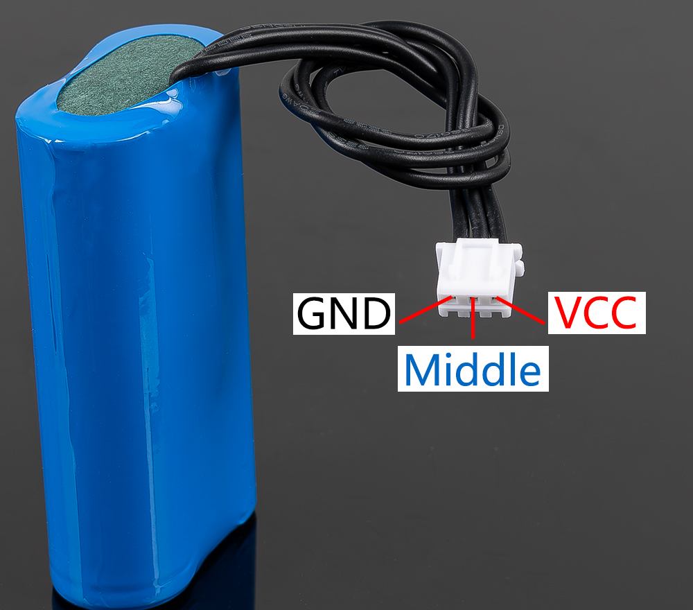

3-pin 电池
=================

* **VCC**: 电池正极端子。此处提供两组 VCC 和 GND，用于增加电流并降低阻抗。  
* **Middle**: 用于平衡两节电池之间的电压，从而保护电池。  
* **GND**: 电池负极端子。  

这是由 SunFounder 定制的电池组，由两节 18650 电池组成，容量为 2000mAh。其接口为 XH2.54 3P，可在插入 Robot HAT 后直接充电。  

**参数特性**

* 组成: 锂离子电池 (Li-ion)  
* 电池容量: 2000mAh, 14.8Wh  
* 电池重量: 90.8g  
* 电芯数量: 2  
* 接口: XH2.54 3P  
* 过放电保护: 6.0V  

5-pin 电池
-----------------------------------

.. image:: img/5pin_battery.jpg

* **VCC**: 电池正极端子。此处同样提供两组 VCC 和 GND，用于增加电流并降低阻抗。  
* **Middle**: 用于平衡两节电池之间的电压，从而保护电池。  
* **GND**: 电池负极端子。  

这是由 SunFounder 定制的电池组，由两节 18650 电池组成，容量为 2000mAh。其接口为 PH2.0-5P，可在插入扩展板后直接充电。  

**参数特性**

* **组成**: 锂离子电池 (Li-ion)  
* **电池容量**: 2000mAh, 14.8Wh  
* **电池重量**: 90.8g  
* **电芯数量**: 2  
* **接口**: PH2.0-5P  
* **过放电保护**: 6.0V  