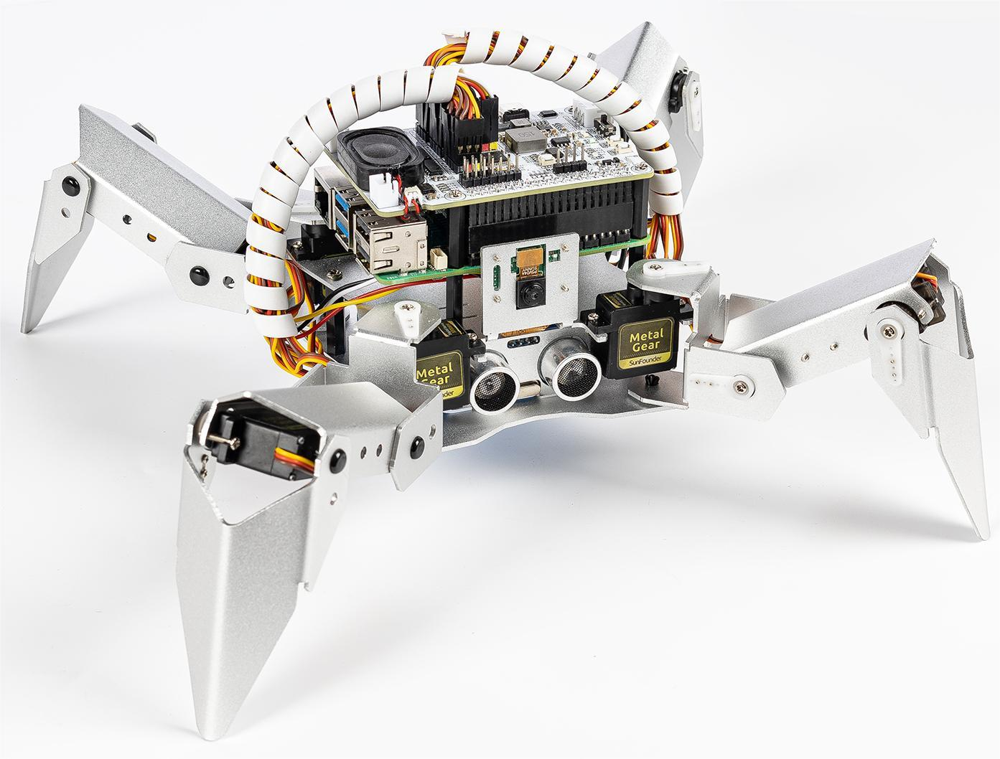

.. note:: 

    こんにちは、SunFounder Raspberry Pi & Arduino & ESP32 愛好者コミュニティへようこそ！ Raspberry Pi、Arduino、ESP32 について、他の愛好者と一緒に深く掘り下げて学びましょう。

    **参加する理由は？**

    - **専門的なサポート**: 購入後の問題や技術的な課題を、コミュニティやチームの助けを借りて解決できます。
    - **学びと共有**: スキルを高めるためのヒントやチュートリアルを交換しましょう。
    - **限定プレビュー**: 新しい製品発表や先行プレビューに早期アクセスできます。
    - **特別割引**: 最新製品に対する独占的な割引を楽しめます。
    - **祝典プロモーションとプレゼント**: プレゼントキャンペーンや季節ごとのプロモーションに参加できます。

    👉 私たちと一緒に探求し、創造する準備はできましたか？ [|link_sf_facebook|] をクリックして、今すぐ参加しましょう！

SunFounder Raspberry Pi ロボット - |link_PiCrawler|
=====================================================

* |link_Pi_Crawler|

|link_PiCrawler| をお選びいただきありがとうございます。

.. note::
    このドキュメントは以下の言語で利用可能です。

        * |link_en_tutorials|
        * |link_ja_tutorials|
        * |link_german_tutorials|
        * |link_fr_tutorials|
        * |link_es_tutorials|
   
    ご希望の言語のリンクをクリックして、ドキュメントにアクセスしてください。

PiCrawlerは、アルミ合金製の構造を持つRaspberry Pi用の四足歩行ロボットです。 
カメラモジュールが搭載されており、カラー認識や顔認識などを実行できます。 
12個の金属ギアサーボモーターにより、歩行、ダンス、さまざまなポーズを取ることができます。 
本体に搭載された超音波モジュールは、前方の障害物を迅速に検知することができます。拡張ボードであるロボットHATにはスピーカーも搭載されており、喜びや興奮といった感情を表現することができます。

この文書には、リストおよび組み立てのPDF、Robot HATの紹介、そしてPiCrawlerのプログラミングが含まれています。

プログラミング部分は、:ref:`play_ezblock` と :ref:`play_python` の2章に分かれており、それぞれの章でPiCrawlerを希望通りに動作させる方法を説明しています。

Ezblock Studioは、SunFounderが初心者向けに開発した開発プラットフォームで、Raspberry Piの導入障壁を下げることを目的としています。グラフィカルとPythonという2つのプログラミング言語をサポートしており、ほぼすべての異なるデバイスで使用可能です。BluetoothとWi-Fiにも対応しており、Ezblock Studioでコードをダウンロードして、Raspberry Piをリモートで制御できます。

より経験豊富なメイカーは、人気のあるプログラミング言語であるPythonを使用することができます。

ご質問がある場合は、service@sunfounder.comまでメールをお送りください。できるだけ早くご返答いたします。

**内容**

.. toctree::
    :maxdepth: 2

    About this Kit <self>
    python/play_with_python 
    ezblock/play_with_ezblock
    servo_zeroing
    openai
    appendix/appendix
    hardware/cpn_hardware
    faq

著作権について
--------------------------

本マニュアルに含まれるすべてのコンテンツ（テキスト、画像、コードを含むがこれに限られない）はSunFounder社に帰属します。これらのコンテンツは、個人的な学習、調査、楽しみ、またはその他の非商業的・非営利的な目的でのみ使用できます。著作権法および関連法規に従い、著者および関連する権利者の法的権利を侵害しない範囲で使用する必要があります。これらのコンテンツを商業的利益のために無断で使用する個人または団体に対して、会社は法的措置を取る権利を有します。
