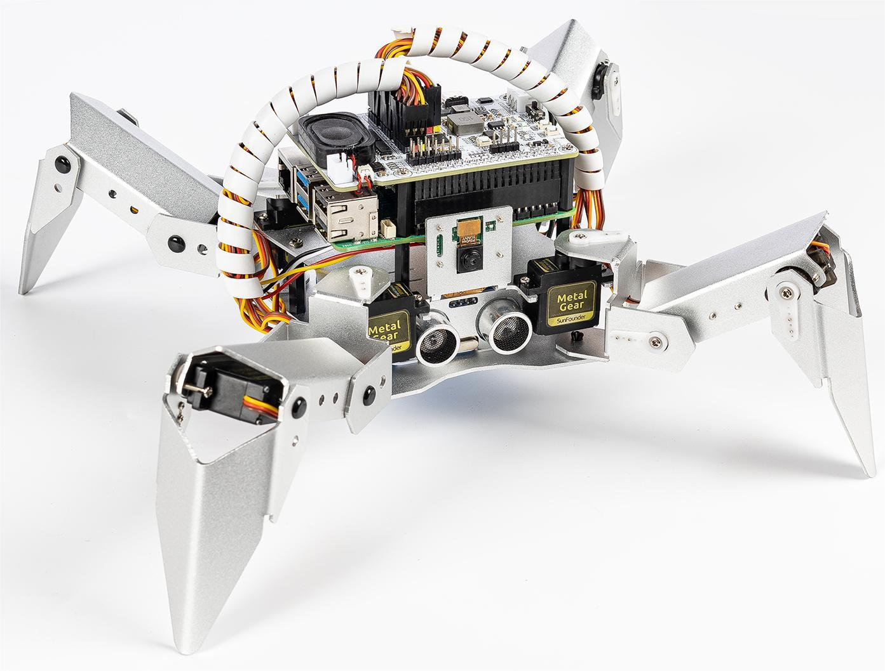

.. note:: 

    Hola, bienvenido a la comunidad de entusiastas de SunFounder Raspberry Pi & Arduino & ESP32 en Facebook. ¡Explora más a fondo Raspberry Pi, Arduino y ESP32 con otros entusiastas!

    **¿Por qué unirse?**

    - **Soporte experto**: Resuelve problemas postventa y desafíos técnicos con la ayuda de nuestra comunidad y equipo.
    - **Aprende y comparte**: Intercambia consejos y tutoriales para mejorar tus habilidades.
    - **Avances exclusivos**: Obtén acceso anticipado a anuncios de nuevos productos y vistas previas.
    - **Descuentos especiales**: Disfruta de descuentos exclusivos en nuestros productos más recientes.
    - **Promociones festivas y sorteos**: Participa en sorteos y promociones de temporada.

    👉 ¿Listo para explorar y crear con nosotros? Haz clic en [|link_sf_facebook|] y únete hoy mismo.

SunFounder Raspberry Pi Robot - |link_PiCrawler|
=====================================================

* |link_Pi_Crawler|

Gracias por elegir nuestro |link_PiCrawler|.

.. note::
    Este documento está disponible en los siguientes idiomas:

        * |link_en_tutorials|
        * |link_zh_tutorials|
        * |link_ja_tutorials|
        * |link_german_tutorials|
        * |link_fr_tutorials|
        * |link_es_tutorials|
        * |link_it_tutorials|
   
    Haga clic en los enlaces correspondientes para acceder al documento en el idioma de su preferencia.

PiCrawler es un robot cuadrúpedo basado en Raspberry Pi con una estructura de aleación de aluminio.  
Cuenta con un módulo de cámara para reconocimiento de color y detección de rostros, 12 servos de engranajes metálicos para caminar y movimientos dinámicos, un sensor ultrasónico para la detección de obstáculos y un Robot HAT con un altavoz integrado para efectos de sonido expresivos.

Esta documentación incluye la lista de piezas, la guía de ensamblaje, la introducción al Robot HAT y los tutoriales de programación de PiCrawler.

La programación se divide en dos capítulos:

* :ref:`play_ezblock`: Usar Ezblock Studio para programación gráfica.
* :ref:`play_python`: Los usuarios más experimentados pueden programar PiCrawler directamente con Python.

Si tienes alguna pregunta, ponte en contacto con service@sunfounder.com.

**Contenido**

.. toctree::
    :maxdepth: 2

    About this Kit <self>
    assemble_video
    python/play_with_python 
    ezblock/play_with_ezblock
    servo_zeroing
    openai
    appendix
    hardware/cpn_hardware
    faq

Aviso de Derechos de Autor
------------------------------

Todos los contenidos, incluidos pero no limitados a textos, imágenes y código en este manual, son propiedad de SunFounder Company. Debes utilizarlos únicamente para estudios personales, investigación, disfrute u otros propósitos no comerciales o sin fines de lucro, bajo las regulaciones y leyes de derechos de autor relacionadas, sin infringir los derechos legales del autor y los titulares de derechos correspondientes. Para cualquier individuo u organización que utilice estos contenidos con fines comerciales sin permiso, la Compañía se reserva el derecho de emprender acciones legales.
