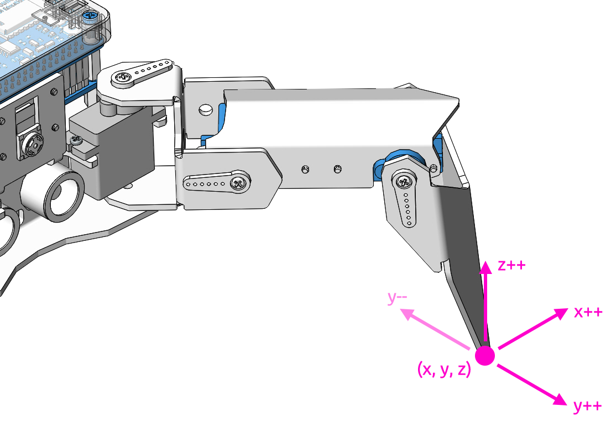

.. note::

    Hello, welcome to the SunFounder Raspberry Pi & Arduino & ESP32 Enthusiasts Community on Facebook! Dive deeper into Raspberry Pi, Arduino, and ESP32 with fellow enthusiasts.

    **Why Join?**

    - **Expert Support**: Solve post-sale issues and technical challenges with help from our community and team.
    - **Learn & Share**: Exchange tips and tutorials to enhance your skills.
    - **Exclusive Previews**: Get early access to new product announcements and sneak peeks.
    - **Special Discounts**: Enjoy exclusive discounts on our newest products.
    - **Festive Promotions and Giveaways**: Take part in giveaways and holiday promotions.

    👉 Ready to explore and create with us? Click [|link_sf_facebook|] and join today!

.. _py_posture:

Adjust Posture
=====================

In this example, we use the keyboard to control the PiCrawler foot by foot and assume the desired posture.

You can press the space bar to print out the current coordinate values. These coordinate values come in handy when you create unique actions for PiCrawler.



**Run the Code**

.. raw:: html

    <run></run>

.. code-block::

    cd ~/picrawler/examples
    sudo python3 do_single_leg.py

After the code runs, please operate according to the prompt that pops up in the terminal.

* Press ``1234`` to select the feet separately, ``1``: right front foot, ``2``: left front foot, ``3``: left rear foot, ``4``: right rear foot
* Press ``w``, ``a``, ``s``, ``d``, ``r``, and ``f`` to slowly control the PiCrawler's coordinate values.
* Press ``Ctrl+C`` to exit.


**Code**

.. code-block:: python

    #!/usr/bin/env python3
    from picrawler import Picrawler
    from time import sleep
    import readchar

    crawler = Picrawler()

    SPEED = 80
    STEP_SIZE = 2

    manual = '''
    -------- PiCrawler Controller ---------
        .......          .......
        <=|   2   |┌-┌┐┌┐-┐|   1   |=>
        ``````` ├      ┤ ```````
        ....... ├      ┤ .......
        <=|   3   |└------┘|   4   |=>
        ```````          ```````
        1: Select right front leg
        2: Select left front leg
        3: Select left rear leg
        4: Select right rear leg

        W: Y++          R: Z++
        A: X--          F: Z--
        S: Y--
        D: X++          Ctrl+C: Quit
    '''

    legs_list = ['right front', 'left front', 'left rear', 'right rear']

    # Axis mapping for cleaner logic
    move_map = {
        'w': (1, +STEP_SIZE),  # Y++
        's': (1, -STEP_SIZE),  # Y--
        'a': (0, -STEP_SIZE),  # X--
        'd': (0, +STEP_SIZE),  # X++
        'r': (2, +STEP_SIZE),  # Z++
        'f': (2, -STEP_SIZE),  # Z--
    }


    def clear_screen():
        print("\033[H\033[J", end='')


    def show_info(selected_leg, coordinate):
        clear_screen()
        print(manual)
        print(f"Selected leg: {selected_leg + 1} - {legs_list[selected_leg]}")
        print(f"Coordinate: {coordinate}")


    def main():
        selected_leg = 0

        try:
            print(manual)

            # Stand up first
            crawler.do_step('stand', 40)
            sleep(0.5)

            # Get current coordinates
            coordinate = crawler.current_step_all_leg_value()
            show_info(selected_leg, coordinate)

            while True:
                key = readchar.readkey().lower()

                # Select leg
                if key in ('1', '2', '3', '4'):
                    selected_leg = int(key) - 1
                    show_info(selected_leg, coordinate)

                # Move selected leg
                elif key in move_map:
                    axis, delta = move_map[key]

                    # Update coordinate
                    coordinate[selected_leg][axis] += delta

                    # Send updated position
                    crawler.do_single_leg(selected_leg, coordinate[selected_leg], SPEED)
                    sleep(0.1)

                    show_info(selected_leg, coordinate)

                sleep(0.05)

        except KeyboardInterrupt:
            print("\nExiting safely...")

        finally:
            # Return to sitting position on exit
            try:
                crawler.do_step('sit', 40)
                sleep(1)
            except Exception:
                pass

            print("Robot is now sitting. Program ended.")


    if __name__ == "__main__":
        main()

* ``current_step_all_leg_value()``: Returns the coordinate values of all legs.
* ``do_single_leg(leg,coordinate[leg],speed)``: Modify the coordinate value of a certain leg individually.