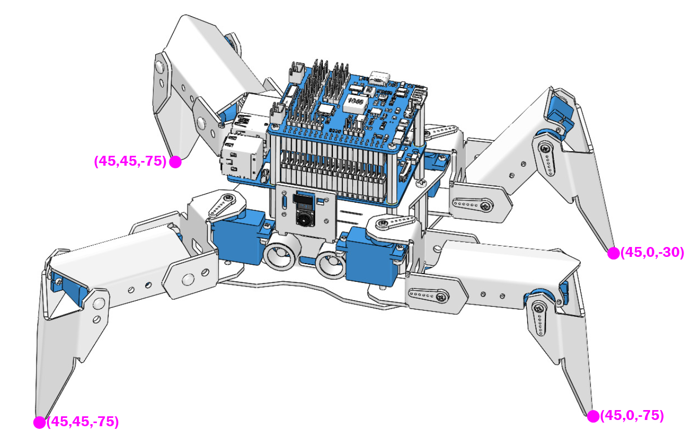
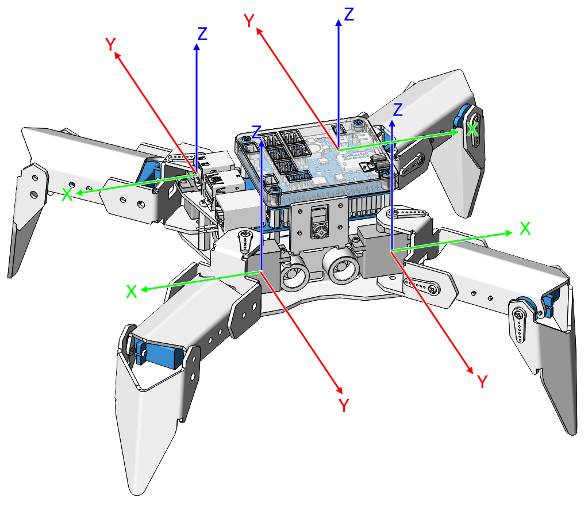
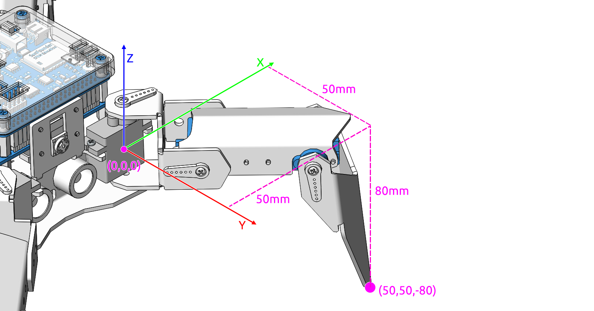

.. note::

    Hello, welcome to the SunFounder Raspberry Pi & Arduino & ESP32 Enthusiasts Community on Facebook! Dive deeper into Raspberry Pi, Arduino, and ESP32 with fellow enthusiasts.

    **Why Join?**

    - **Expert Support**: Solve post-sale issues and technical challenges with help from our community and team.
    - **Learn & Share**: Exchange tips and tutorials to enhance your skills.
    - **Exclusive Previews**: Get early access to new product announcements and sneak peeks.
    - **Special Discounts**: Enjoy exclusive discounts on our newest products.
    - **Festive Promotions and Giveaways**: Take part in giveaways and holiday promotions.

    👉 Ready to explore and create with us? Click [|link_sf_facebook|] and join today!

.. _py_pose:

Pose
=============

PiCrawler can assume a specific posture by writing a coordinate array. Here it assumes a raised right rear foot posture.

**Run the Code**

.. raw:: html

    <run></run>

.. code-block::

    cd ~/picrawler/examples
    sudo python3 do_step.py

After running the program, the robot first stands up slowly to reach a stable posture.

Once standing, the robot repeatedly performs two actions in a loop. It first moves into a standing step posture and holds the position for a few seconds, then switches to a custom step where the legs move to different coordinates. This creates a repeating posture-changing motion.

The robot continues alternating between these two poses until the program is stopped. If **Ctrl+C** is pressed, the program exits safely and the robot returns to a sitting position.

**Code**

.. raw:: html

    <run></run>

.. code-block:: python

    #!/usr/bin/env python3
    from picrawler import Picrawler
    from time import sleep

    # Create Picrawler instance
    crawler = Picrawler()

    # Leg order:
    # [right front], [left front], [left rear], [right rear]
    new_step = [[45, 45, -75], [45, 0, -75], [45, 0, -30], [45, 45, -75]]

    # Get the default stand step from the move list
    stand_step = crawler.move_list['stand'][0]

    def main():
        action_speed = 80  # Speed for movement actions

        try:
            # Stand up slowly at 40% speed to reduce current spikes
            crawler.do_step('stand', 40)
            sleep(1.0)

            # Continuous action loop
            while True:
                crawler.do_step(stand_step, action_speed)
                sleep(3)

                crawler.do_step(new_step, action_speed)
                sleep(3)

        except KeyboardInterrupt:
            # Handle Ctrl+C for safe exit
            print("\nExiting safely...")

        finally:
            # Return to sitting position before shutting down
            try:
                crawler.do_step('sit', 40)
                sleep(1.0)
            except Exception:
                pass

    if __name__ == "__main__":
        main()

**How it works?**

In this code, the code you need to pay attention to is this ``crawler.do_step()``.

Similar to ``do_action()``, ``do_step()`` can also manipulate PiCrawler's behavior.
The difference is that the former can perform the continuous behavior of ``move forward``, while the latter can be used to make separate gestures of ``stand`` and ``sit``.

It has two uses:

One: It can write strings, directly use the ``step_list`` dictionary in the ``picrawler`` library.

.. code-block:: python

    crawler.do_step('stand',speed) 
    # "speed" indicates the speed of the step, the range is 0~100.

Second: It can also write an array of 4 coordinate values.

.. code-block:: python

    new_step=[[45, 45, -75], [45, 0, -75], [45, 0, -30], [45, 45, -75]]
    # These four coordinates are used to control the four legs of right front, left front, left rear, and left rear respectively.

Each foot has an independent coordinate system. As shown below:

You need to measure the coordinates of each toe individually. As shown below:

By the way: the ``step_list`` called in the first method also consists of an array containing 4 coordinate values.

.. code-block:: python

    step_list = {

        "stand":[
            [45, 45, -50], 
            [45, 45, -50], 
            [45, 45, -50], 
            [45, 45, -50]
        ],
        "sit":[
            [45, 45, -30], 
            [45, 45, -30], 
            [45, 45, -30], 
            [45, 45, -30]
        ],
              
    }

