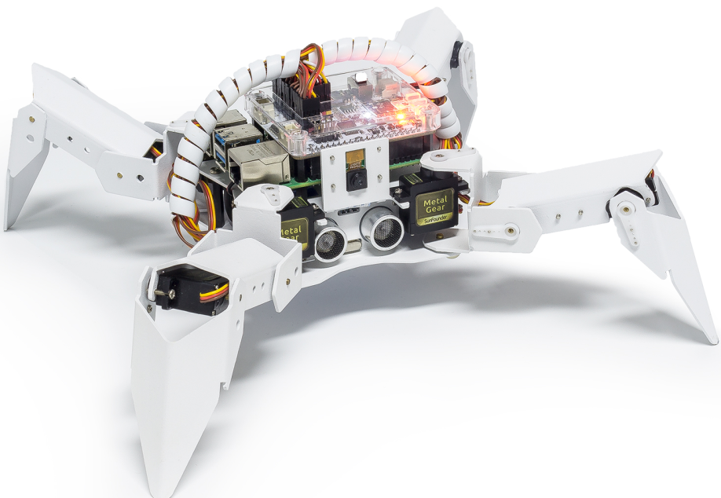

.. note::

    Hello, welcome to the SunFounder Raspberry Pi & Arduino & ESP32 Enthusiasts Community on Facebook! Dive deeper into Raspberry Pi, Arduino, and ESP32 with fellow enthusiasts.

    **Why Join?**

    - **Expert Support**: Solve post-sale issues and technical challenges with help from our community and team.
    - **Learn & Share**: Exchange tips and tutorials to enhance your skills.
    - **Exclusive Previews**: Get early access to new product announcements and sneak peeks.
    - **Special Discounts**: Enjoy exclusive discounts on our newest products.
    - **Festive Promotions and Giveaways**: Take part in giveaways and holiday promotions.

    👉 Ready to explore and create with us? Click [|link_sf_facebook|] and join today!

.. _py_move:

Move
==============

This is PiCrawler's first project. Perform its most basic function - move.

**Run the Code**

.. raw:: html

    <run></run>

.. code-block::

    cd ~/picrawler/examples
    sudo python3 move.py

After the code is executed, PiCrawler will perform the following actions in sequence: move forward, move backward, turn left, turn right, stand.

**Code**

.. note::
    You can **Modify/Reset/Copy/Run/Stop** the code below. But before that, you need to go to  source code path like ``pisloth\examples``. After modifying the code, you can run it directly to see the effect.

.. raw:: html

    <run></run>

.. code-block:: python

    from picrawler import Picrawler
    from time import sleep

    crawler = Picrawler() 

    def main():  
        
        speed = 80
            
        while True:
        
            crawler.do_action('forward',2,speed)
            sleep(0.05)     
            crawler.do_action('backward',2,speed)
            sleep(0.05)          
            crawler.do_action('turn left',2,speed)
            sleep(0.05)           
            crawler.do_action('turn right',2,speed)
            sleep(0.05)  
            crawler.do_action('turn left angle',2,speed)
            sleep(0.05)  
            crawler.do_action('turn right angle',2,speed)
            sleep(0.05) 
            crawler.do_step('stand',speed)
            sleep(1)

    if __name__ == "__main__":
        main()

**How it works?**

First, import the ``Picrawler`` class from the ``picrawler`` library you have installed, which contains all of PiCrawler's actions and the functions that implement them.

.. code-block:: python

    from picrawler import Picrawler

Then instantiate the ``crawler`` class.

.. code-block:: python

    crawler = Picrawler() 

Finally use the ``crawler.do_action()`` function to make Pisloth move.

.. code-block:: python
    
    crawler.do_action('forward',2,speed)    
    crawler.do_action('backward',2,speed)         
    crawler.do_action('turn left',2,speed)          
    crawler.do_action('turn right',2,speed) 
    crawler.do_action('turn left angle',2,speed) 
    crawler.do_action('turn right angle',2,speed)

In general, all movement of PiCrawler can be implemented with the ``do_action()`` function. It has 3 parameters:

* ``motion_name`` is the name of specific actions, including: ``forward``, ``turn right``, ``turn left``, ``backward``, ``turn left angle``, ``turn right angle``.
* ``step`` represents the number of each action is done, the default is 1.
* ``speed`` indicates the speed of the action, the default is 50 and the range is 0~100.

In addition, ``crawler.do_step('stand',speed)`` is also used here to make PiCrawler stand. The usage of this function will be explained in the following example.