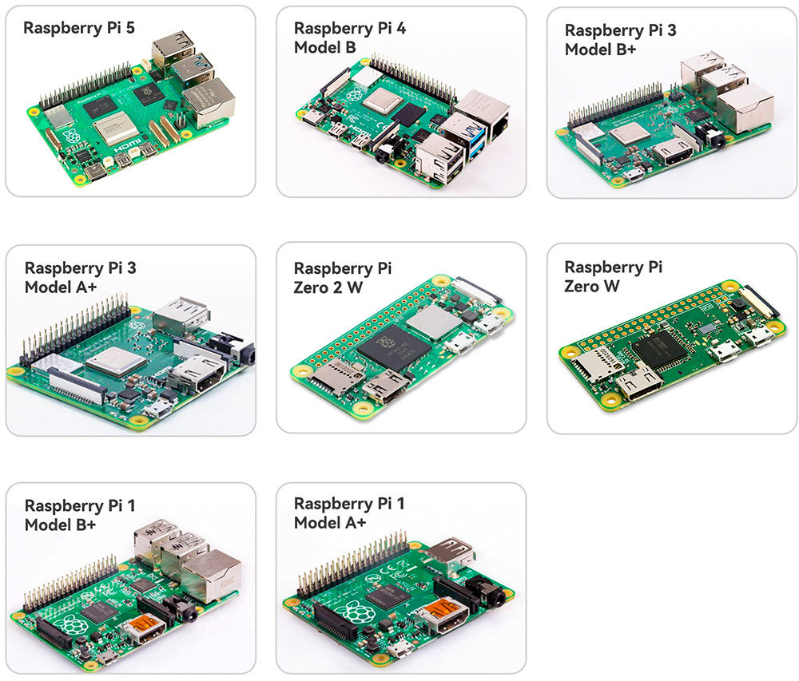

.. note:: 

    Hola, bienvenido a la comunidad de entusiastas de SunFounder Raspberry Pi & Arduino & ESP32 en Facebook. ¡Explora más a fondo Raspberry Pi, Arduino y ESP32 con otros entusiastas!

    **¿Por qué unirse?**

    - **Soporte experto**: Resuelve problemas postventa y desafíos técnicos con la ayuda de nuestra comunidad y equipo.
    - **Aprende y comparte**: Intercambia consejos y tutoriales para mejorar tus habilidades.
    - **Avances exclusivos**: Obtén acceso anticipado a anuncios de nuevos productos y vistas previas.
    - **Descuentos especiales**: Disfruta de descuentos exclusivos en nuestros productos más recientes.
    - **Promociones festivas y sorteos**: Participa en sorteos y promociones de temporada.

    👉 ¿Listo para explorar y crear con nosotros? Haz clic en [|link_sf_facebook|] y únete hoy mismo.

1. ¿Qué Necesitamos?
===========================

Componentes Requeridos
-----------------------

**Raspberry Pi**

La Raspberry Pi es un ordenador del tamaño de una tarjeta de crédito y de bajo costo, 
que se conecta a un monitor de computadora o TV y utiliza un teclado y ratón estándar. 
Es un dispositivo potente que permite a personas de todas las edades explorar la 
informática y aprender a programar en lenguajes como Scratch y Python.

**Adaptador de Corriente**

Para conectarse a una toma de corriente, la Raspberry Pi tiene un puerto micro USB 
(el mismo que se encuentra en muchos teléfonos móviles). Necesitarás una fuente de 
alimentación que proporcione al menos 2.5 amperios.

**Tarjeta Micro SD**

Tu Raspberry Pi necesita una tarjeta Micro SD para almacenar todos sus archivos y el 
sistema operativo Raspberry Pi OS. Se recomienda una tarjeta Micro SD con una capacidad 
de al menos 8 GB.

Componentes Opcionales
-------------------------

**Pantalla**

Para visualizar el entorno de escritorio de la Raspberry Pi, necesitas una pantalla 
que puede ser un televisor o un monitor de computadora. Si la pantalla tiene altavoces 
integrados, la Raspberry Pi reproducirá sonido a través de ellos.

**Ratón y Teclado**

Cuando usas una pantalla, también se necesita un teclado USB y un ratón USB.

**HDMI**

La Raspberry Pi tiene un puerto de salida HDMI compatible con los puertos HDMI de la 
mayoría de los televisores y monitores modernos. Si tu pantalla solo tiene puertos DVI 
o VGA, necesitarás usar un cable de conversión adecuado.

**Carcasa**

Puedes colocar la Raspberry Pi en una carcasa; de esta manera, protegerás tu dispositivo.

**Altavoz o Auriculares**

La Raspberry Pi está equipada con un puerto de audio de 3.5 mm que puede usarse cuando tu 
pantalla no tiene altavoces integrados o cuando no hay operación en pantalla.
