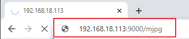

.. note:: 

    こんにちは！SunFounder Raspberry Pi & Arduino & ESP32 Enthusiasts Communityへようこそ！Raspberry Pi、Arduino、ESP32に興味がある仲間たちと一緒に、さらに深く学んでいきましょう。

    **なぜ参加するのか？**

    - **専門家のサポート**: 購入後の問題や技術的な課題を、コミュニティやチームのサポートを通じて解決できます。
    - **学びと共有**: ヒントやチュートリアルを交換して、スキルを向上させましょう。
    - **限定プレビュー**: 新製品の発表に早期アクセスし、先行して情報を得られます。
    - **特別割引**: 最新の製品に対して、限定の割引を楽しむことができます。
    - **祝祭プロモーションとプレゼント**: プレゼント企画や祝祭プロモーションに参加できます。

    👉 私たちと一緒に探求し、創造する準備はできましたか？[|link_sf_facebook|]をクリックして、今すぐ参加しましょう！

.. _py_treasure:

宝探し
============================

部屋に迷路を作り、6つの異なる色のカードを6つの隅に配置します。その後、PiCrawlerを使って、これらの色のカードを一つずつ探していきます！

.. note:: 色の検出のために、:download:`PDFカラーカード <https://github.com/sunfounder/sf-pdf/raw/master/prop_card/object_detection/color-cards.pdf>` をダウンロードして印刷できます。

**コードを実行する**

.. raw:: html

    <run></run>

.. code-block::

    cd ~/picrawler/examples
    sudo python3 treasure_hunt.py

**画像を表示する**

コードが実行されると、ターミナルに以下のようなプロンプトが表示されます：

.. code-block::

    No desktop !
    * Serving Flask app "vilib.vilib" (lazy loading)
    * Environment: production
    WARNING: Do not use the development server in a production environment.
    Use a production WSGI server instead.
    * Debug mode: off
    * Running on http://0.0.0.0:9000/ (Press CTRL+C to quit)

その後、ブラウザに ``http://<your IP>:9000/mjpg`` と入力して、動画画面を表示できます。例えば、 ``http://192.168.18.113:9000/mjpg`` 。

**コード**

.. code-block:: python

	#!/usr/bin/env python3
	from picrawler import Picrawler
	from time import sleep, time
	from robot_hat import Music, TTS
	from vilib import Vilib
	import readchar
	import random
	import threading

	crawler = Picrawler()
	music = Music()   # kept for compatibility (not used here)
	tts = TTS()

	MANUAL = '''
	Press keys on keyboard to control Picrawler!
		w: Forward
		a: Turn left
		s: Backward
		d: Turn right
		space: Say the target again
		Ctrl+C: Quit
	'''

	color = "red"
	color_list = ["red", "orange", "yellow", "green", "blue", "purple"]

	key_dict = {
		'w': 'forward',
		's': 'backward',
		'a': 'turn_left',
		'd': 'turn_right',
	}

	# ----------------------------
	# Thread-safe key handling
	# ----------------------------
	lock = threading.Lock()
	key_state = None               # last key event
	stop_event = threading.Event() # signal to exit cleanly

	def set_key(k):
		global key_state
		with lock:
			key_state = k

	def pop_key():
		"""Read and clear the last key event."""
		global key_state
		with lock:
			k = key_state
			key_state = None
		return k

	def key_scan_thread():
		"""Keyboard input thread (quiet exit on Ctrl+C)."""
		while not stop_event.is_set():
			try:
				k = readchar.readkey()
			except KeyboardInterrupt:
				# Ctrl+C may raise KeyboardInterrupt inside this thread
				stop_event.set()
				break
			except Exception:
				sleep(0.02)
				continue

			if k == readchar.key.SPACE:
				set_key('space')
			elif k == readchar.key.CTRL_C:
				set_key('quit')
				stop_event.set()
				break
			else:
				try:
					set_key(str(k).lower())
				except Exception:
					pass

			sleep(0.01)

	# ----------------------------
	# Game logic
	# ----------------------------
	def renew_color_detect():
		global color
		color = random.choice(color_list)
		try:
			Vilib.color_detect(color)
		except Exception:
			pass
		try:
			tts.say("Look for " + color)
		except Exception:
			pass

	def safe_camera_close():
		try:
			Vilib.color_detect("close")
		except Exception:
			pass
		try:
			Vilib.camera_close()
		except Exception:
			pass

	def safe_sit():
		try:
			crawler.do_step('sit', 40)
			sleep(0.5)
		except Exception:
			pass

	def stand_ready():
		"""
		Stand up after startup.
		Requirement: stand at 40, then only move after WASD is pressed.
		"""
		try:
			crawler.do_step('stand', 40)
			sleep(0.8)
		except Exception:
			pass

	def main():
		speed = 80
		action = None

		# Start camera + web preview
		Vilib.camera_start(vflip=False, hflip=False)
		Vilib.display(local=False, web=True)
		sleep(0.8)

		print(MANUAL)

		# Start keyboard thread (daemon, so it won't block process exit)
		t = threading.Thread(target=key_scan_thread, daemon=True)
		t.start()

		# Announce and stand up to 40
		try:
			tts.say("game start")
		except Exception:
			pass
		sleep(0.05)

		stand_ready()
		renew_color_detect()

		try:
			while not stop_event.is_set():
				# If target detected and large enough -> renew target
				try:
					n = Vilib.detect_obj_parameter.get('color_n', 0)
					w = Vilib.detect_obj_parameter.get('color_w', 0)
				except Exception:
					n, w = 0, 0

				if n != 0 and w > 100:
					try:
						tts.say("well done")
					except Exception:
						pass
					sleep(0.05)
					renew_color_detect()

				# Handle key event
				k = pop_key()

				if k in key_dict:
					action = key_dict[k]

				elif k == 'space':
					try:
						tts.say("Look for " + color)
					except Exception:
						pass

				elif k == 'quit':
					stop_event.set()

				# Move only after receiving a WASD action
				if action is not None:
					try:
						crawler.do_action(action, 1, speed)
					except Exception:
						pass
					action = None

				sleep(0.05)

		except KeyboardInterrupt:
			stop_event.set()

		finally:
			# Clean exit
			stop_event.set()
			safe_camera_close()
			safe_sit()
			print("\nQuit")

	if __name__ == "__main__":
		main()

**仕組みは？**

#. このプログラムの概要

   このプログラムは、PiCrawler 用のシンプルな「宝探しゲーム」です。

   • カメラ映像は Web ページにストリーミングされます（ローカル GUI ウィンドウは使用しません）。  
   • Vilib がターゲットカラー（red / orange / yellow / green / blue / purple）を検出します。  
   • WASD キーでロボットを操作します。  
   • 検出された色の物体が十分大きくなると、プログラムは成功をアナウンスし、新しいターゲットカラーに切り替えます。  
   • Ctrl+C を押すと、スレッドのエラー表示なしで安全に終了します。

#. キーボード入力はバックグラウンドスレッドで処理

   .. code-block:: python

      stop_event = threading.Event()
      key_state = None

      def key_scan_thread():
          while not stop_event.is_set():
              try:
                  k = readchar.readkey()
              except KeyboardInterrupt:
                  stop_event.set()
                  break

   キーボード入力の読み取りは、専用のスレッドで実行されます。  
   これにより、キー入力待ちでメインループがブロックされるのを防ぎます。

   Ctrl+C はこのスレッド内（readchar の動作）で KeyboardInterrupt を発生させることがあるため、  
   それを捕捉してエラー表示ではなくクリーン終了のトリガーとして使用します。

#. キーイベントの安全な共有

   .. code-block:: python

      lock = threading.Lock()

      def set_key(k):
          global key_state
          with lock:
              key_state = k

      def pop_key():
          global key_state
          with lock:
              k = key_state
              key_state = None
          return k

   プログラムは共有変数 ``key_state`` を保護するためにロックを使用します。

   キーボードスレッドは ``set_key()`` を使ってキーイベントを書き込み、  
   メインループは ``pop_key()`` を使ってイベントを読み取り、同時にクリアします。

   これにより、競合状態を防ぎながら安全にキー入力へ反応できます。

#. カメラと Web プレビュー

   .. code-block:: python

      Vilib.camera_start(vflip=False, hflip=False)
      Vilib.display(local=False, web=True)

   カメラを起動し、Web プレビューを有効にします。  
   ``local=False`` にすることで、デスクトップ環境のないシステムで  
   GUI クラッシュが発生するのを防ぎます。

#. まず立ち上がり、その後操作キーを待つ

   .. code-block:: python

      crawler.do_step('stand', 40)
      sleep(0.8)

   起動後、ロボットは速度 40 で立ち上がり、姿勢を安定させます。  
   プログラムはロボットを自動で動かしません。  
   WASD キーが入力されたときのみ動作します。

#. ターゲットカラーの選択

   .. code-block:: python

      color = random.choice(COLOR_LIST)
      Vilib.color_detect(color)
      tts.say("Look for " + color)

   リストからランダムに色が選ばれます。  
   Vilib のカラー検出がその色に対して有効になります。  
   TTS が現在のターゲットを読み上げ、ユーザーに探す色を知らせます。

#. 「成功」の検出とターゲットの切り替え

   .. code-block:: python

      n = Vilib.detect_obj_parameter.get('color_n', 0)
      w = Vilib.detect_obj_parameter.get('color_w', 0)

      if n != 0 and w > 100:
          tts.say("well done")
          renew_color_detect()

   Vilib は ``detect_obj_parameter`` を継続的に更新します。

   • ``color_n`` はターゲットが検出されたかどうかを示します  
   • ``color_w`` は検出された物体の幅（距離 / 大きさの目安）です

   ターゲットが存在し、かつ十分大きい場合、  
   プログラムは成功をアナウンスし、すぐに新しいランダムカラーへ切り替えます。

#. WASD による移動制御

   .. code-block:: python

      if k in key_dict:
          action = key_dict[k]

      if action is not None:
          crawler.do_action(action, 1, speed)
          action = None

   メインループはキーイベントを確認します：

   • w → forward  
   • s → backward  
   • a → turn_left  
   • d → turn_right  

   移動キーが押されると、ロボットは短い動作ステップを1回実行します。  
   この設計により、操作の反応性を保ちながら、  
   ロボットが暴走するような連続移動を防ぎます。

#. スペースキー：ターゲットメッセージの再表示

   .. code-block:: python

      elif k == 'space':
          tts.say("Look for " + color)

   Space キーを押すと、現在のターゲットメッセージを再度読み上げます。  
   ユーザーがターゲットカラーを忘れた場合に便利です。

#. 終了処理とクリーンアップ

   .. code-block:: python

      finally:
          stop_event.set()
          Vilib.color_detect("close")
          Vilib.camera_close()
          crawler.do_step('sit', 40)

   プログラム終了時：

   • ``stop_event`` によりキーボードスレッドを停止します。  
   • Vilib のカラー検出を無効化します。  
   • カメラを安全に閉じます。  
   • ロボットは座る姿勢に戻ります。

   この終了処理の順序により、カメラリソースのエラーを防ぎ、  
   ロボットが安全な姿勢でプログラムを終了できるようにします。