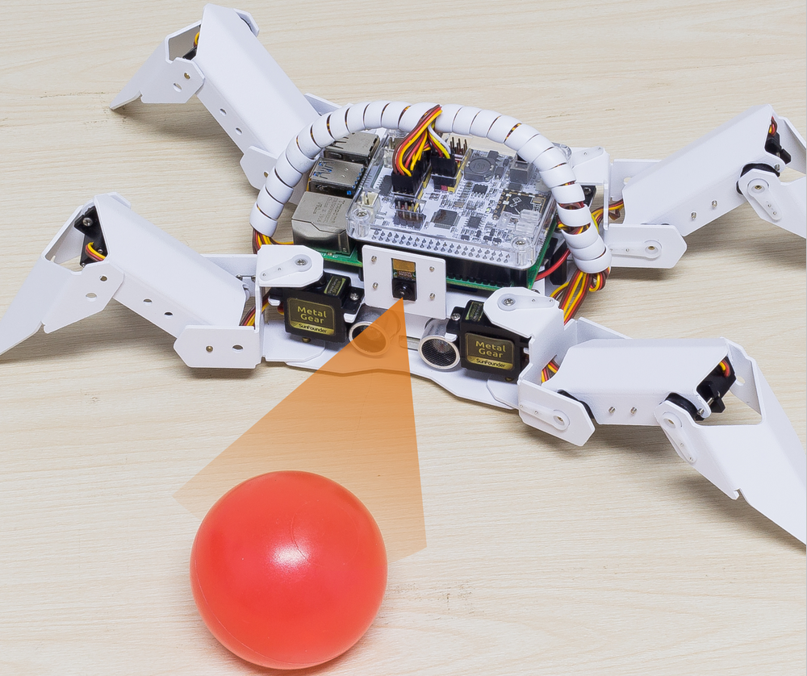
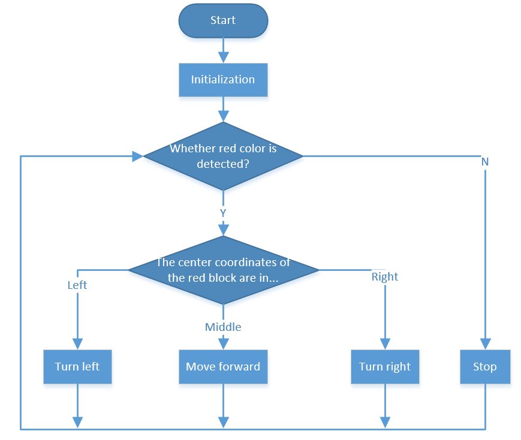

斗牛
==========

让 PiCrawler 成为愤怒的公牛！利用它的相机追踪功能来冲撞红布！

**运行代码**

.. raw:: html

    <run></run>

.. code-block::

    cd /home/pi/picrawler/examples
    sudo python3 bull_fight.py

**查看图像**

代码运行后，如果你在PiCrawler前面放一个红色的物体，比如红布，红球，红色卡片之类的，它就会随着这个红色的物体移动。

同时终端会显示如下提示:

.. code-block::

    No desktop !
    * Serving Flask app "vilib.vilib" (lazy loading)
    * Environment: production
    WARNING: Do not use the development server in a production environment.
    Use a production WSGI server instead.
    * Debug mode: off
    * Running on http://0.0.0.0:9000/ (Press CTRL+C to quit)

代表你可以在浏览器中输入 ``http://<your IP>:9000/mjpg`` 来查看视频画面。 比如:  ``https://192.168.18.113:9000/mjpg``

.. image:: image/display.png

**代码**

.. raw:: html

    <run></run>

.. code-block:: python

    from picrawler import Picrawler
    from time import sleep
    from robot_hat import Music
    from vilib import Vilib

    crawler = Picrawler([10,11,12,4,5,6,1,2,3,7,8,9]) 
    #crawler.set_offset([0,0,0,0,0,0,0,0,0,0,0,0])

    music = Music()

    def main():
        Vilib.camera_start()
        Vilib.display()
        Vilib.color_detect("red") 
        speed = 100

        while True:
            if Vilib.detect_obj_parameter['color_n']!=0:
                coordinate_x = Vilib.detect_obj_parameter['color_x']
                music.sound_effect_threading('./sounds/talk1.wav')

                if coordinate_x < 100:
                    crawler.do_action('turn left',1,speed)
                    sleep(0.05) 
                elif coordinate_x > 220:
                    crawler.do_action('turn right',1,speed)
                    sleep(0.05) 
                else :
                    crawler.do_action('forward',2,speed)
                    sleep(0.05)    
            else :
                crawler.do_step('stand',speed)
                sleep(0.05)

    if __name__ == "__main__":
        main()

**这个怎么运作?**

总的来说，这个项目结合了 :ref:`移动`, :ref:`计算机视觉` 和 :ref:`音效` 的知识点。

其流程如下图所示:

