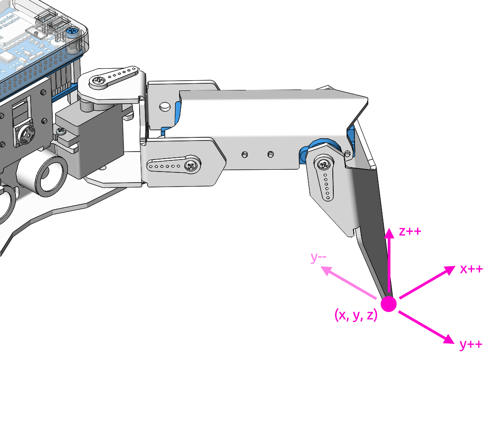

Adjust Posture
=====================

In this example, we use the keyboard to control the PiCrawler foot by foot and assume the desired posture.

You can press the space bar to print out the current coordinate values. These coordinate values come in handy when you create unique actions for PiCrawler.

**Run the Code**

.. raw:: html

    <run></run>

.. code-block::

    cd /home/pi/picrawler/examples
    sudo python3 do_step.py

After the code runs, please operate according to the prompt that pops up in the terminal.

**Code**

.. code-block:: python
 
    from picrawler import Picrawler
    from time import sleep
    import sys
    import tty
    import termios

    crawler = Picrawler([10,11,12,4,5,6,1,2,3,7,8,9]) 
    #crawler.set_offset([0,0,0,0,0,0,0,0,0,0,0,0])
    speed = 80

    def readchar():
        fd = sys.stdin.fileno()
        old_settings = termios.tcgetattr(fd)
        try:
            tty.setraw(sys.stdin.fileno())
            ch = sys.stdin.read(1)
        finally:
            termios.tcsetattr(fd, termios.TCSADRAIN, old_settings)
        return ch

    manual = '''
    Press keys on keyboard to control PiSloth!
        W: Y++
        A: X--
        S: Y--
        D: X++
        R: Z++
        F: Z--
        1: Select right front leg
        2: Select left front leg
        3: Select left rear leg
        4: Select right rear leg
        Space: Print all leg coordinate
        ESC: Quit
    '''

    def main():  

        speed = 80
        print(manual)
        crawler.do_step('stand',speed)
        leg = 0 
        coordinate=crawler.current_step_leg_value(leg)   
        while True:
            key = readchar()
            print(key)
            if 'w' == key:
                coordinate[1]=coordinate[1]+5    
            elif 's' == key:
                coordinate[1]=coordinate[1]-5           
            elif 'a' == key:
                coordinate[0]=coordinate[0]-5         
            elif 'd' == key:
                coordinate[0]=coordinate[0]+5   
            elif 'r' == key:
                coordinate[2]=coordinate[2]+5         
            elif 'f' == key:
                coordinate[2]=coordinate[2]-5       
            elif '1' == key:
                leg=0
                coordinate=crawler.current_step_leg_value(leg)           
            elif '2' == key:
                leg=1   
                coordinate=crawler.current_step_leg_value(leg)              
            elif '3' == key:
                leg=2  
                coordinate=crawler.current_step_leg_value(leg)     
            elif '4' == key:
                leg=3     
                coordinate=crawler.current_step_leg_value(leg)  
            elif chr(32) == key:
                print("[[right front],[left front],[left rear],[right rear]]")
                print(crawler.current_step_all_leg_value())

            elif chr(27) == key:# 27 for ESC
                break    

            sleep(0.05)
            crawler.do_single_leg(leg,coordinate,speed)          
        print("\n q Quit")  
            
    if __name__ == "__main__":
        main()

**How it works?**

What you need to pay attention to in this project are the following three functions:

.. code-block:: python

    current_step_leg_value(leg)
    current_step_all_leg_value()
    do_single_leg(leg,coordinate,speed) 

* ``current_step_leg_value(leg)`` : Returns the coordinate value of the corresponding leg. The parameter ``leg`` can be ``0``, ``1``, ``2``, ``3`` four values, corresponding to right front, left front, left rear, left rear four values respectively leg.
* ``current_step_all_leg_value()`` : Returns the coordinate values of all legs.
* ``do_single_leg(leg,coordinate,speed)`` : Modify the coordinate value of a certain leg individually.