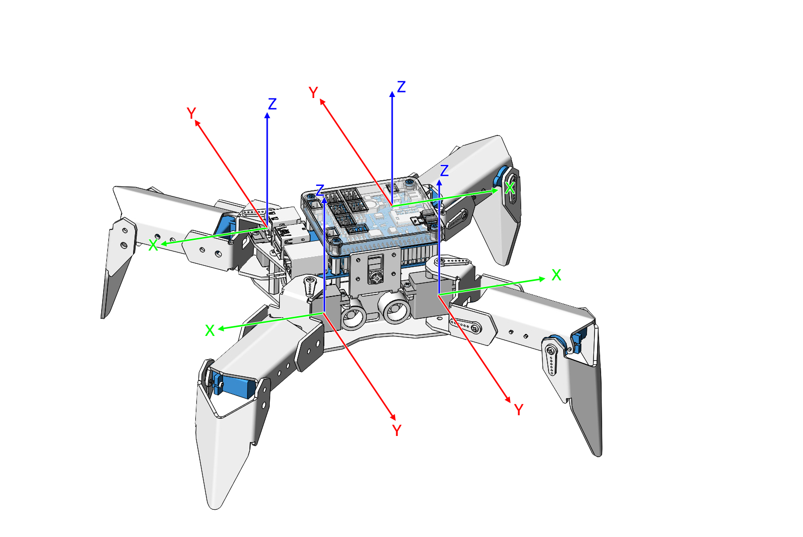

摆姿势
=============

PiCrawler 可以通过写入坐标数组来摆出各种姿势。在这里，它摆出抬起右后脚的姿势。

.. image:: image/4cood.A.png

**运行代码**

.. raw:: html

    <run></run>

.. code-block::

    cd /home/pi/picrawler/examples
    sudo python3 do_step.py

代码运行后，你会看到PiCrawler抬起右脚。

**代码**

.. raw:: html

    <run></run>

.. code-block:: python

    from picrawler import Picrawler
    from time import sleep

    crawler = Picrawler([10,11,12,4,5,6,1,2,3,7,8,9]) 
    #crawler.set_offset([0,0,0,0,0,0,0,0,0,0,0,0])

    ## [right front],[left front],[left rear],[right rear]
    new_step=[[50, 50, -80], [50, 50, -80],[80, 80, 0], [50, 50, -80]]

    def main():  
        
        speed = 100
            
        while True:
            
            crawler.do_step('stand',speed)
            print(crawler.step_list.get('stand'))
            sleep(3)
            crawler.do_step(new_step,speed)
            print(new_step)
            sleep(3)

    if __name__ == "__main__":
        main()

**这个怎么运作?**

在这段代码中需要注意的是 ``crawler.do_step()``。

与 ``do_action()`` 类似, ``do_step()`` 也可以操纵 PiCrawler 的行为。
不同的是前者用于执行连贯的动作如 ``move forward``, 而后者用于执行单独的动作如 ``stand`` 和 ``sit``。

它有两种用法:

一：参数可以接收字符串, 直接使用 ``picrawler`` 库中的 ``step_list`` 字典。

.. code-block:: python

    crawler.do_step('stand',speed) 
    # "speed" indicates the speed of the step, the range is 0~100.

二：也可以接收一个4个坐标值的数组。

.. code-block:: python

    crawler.do_step([[50, 50, -80], [50, 50, -80],[80, 80, 0], [50, 50, -80]],speed)
    # These four coordinates are used to control the four legs of right front, left front, left rear, and left rear respectively.

每只脚都有一个独立的空间直角坐标系。如下所示：:

您需要单独测量每个脚趾的坐标。如下所示：

.. image:: image/1cood.png

其实 ``step_list`` 在第一个方法中调用字符串，其本质也是通过字典来接收包含四个坐标值的数组。

.. code-block:: python

    step_list = {
        "stand":[
            [50, 50, -80],
            [50, 50, -80],
            [50, 50, -80],
            [50, 50, -80]
        ],
        "sit":[
            [50, 50, -33],
            [50, 50, -33],
            [50, 50, -33],
            [50, 50, -33]
        ],
    }

