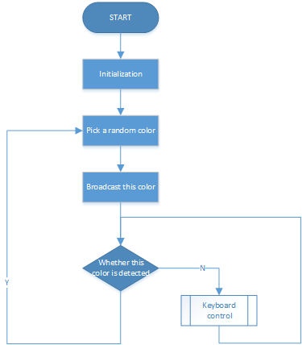

Treasure Hunt
============================

在你的房间布置一个迷宫，在六个角落放下六张不同颜色的色卡。然后操控PiCrawler来一一搜索这些色卡吧！

.. note:: You can download and print the :download:`PDF Color Cards <https://github.com/sunfounder/sf-pdf/raw/master/prop_card/object_detection/color-cards.pdf>` for color detection.

**Run the Code**

.. raw:: html

    <run></run>

.. code-block::

    cd /home/pi/picrawler/examples
    sudo python3 treasure_hunt.py

**View the Image**

代码运行后，terminal会显示以下提示：

.. code-block::

    No desktop !
    * Serving Flask app "vilib.vilib" (lazy loading)
    * Environment: production
    WARNING: Do not use the development server in a production environment.
    Use a production WSGI server instead.
    * Debug mode: off
    * Running on http://0.0.0.0:9000/ (Press CTRL+C to quit)

随后你可以在浏览器中输入 ``http://<your IP>:9000/mjpg`` 来查看视频画面。

如： "https://192.168.18.113:9000/mjpg"

.. image:: image/display.png

**Code**

.. code-block:: python

**How it works?**

总的来说，这个项目结合了 :ref:`Move` ， :ref:`Computer Vision` 和 :ref:`Sound Effect` 的知识点。

它的流程如下图所示

