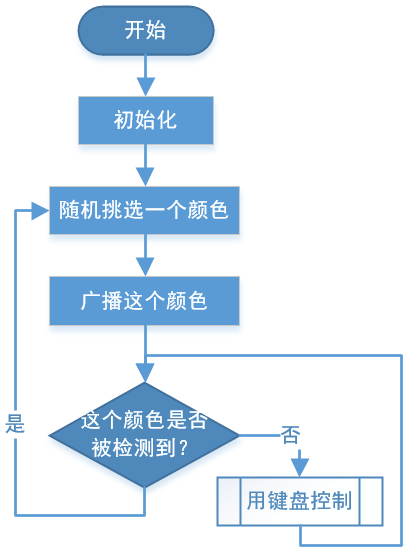

Treasure Hunt
============================

Arrange a maze in your room and place six different color cards in six corners. Then control PiCrawler to search for these color cards one by one!

.. note:: You can download and print the :download:`PDF Color Cards <https://github.com/sunfounder/sf-pdf/raw/master/prop_card/object_detection/color-cards.pdf>` for color detection.

**Run the Code**

.. raw:: html

    <run></run>

.. code-block::

    cd /home/pi/picrawler/examples
    sudo python3 treasure_hunt.py

**View the Image**

After the code runs, the terminal will display the following prompt:

.. code-block::

    No desktop !
    * Serving Flask app "vilib.vilib" (lazy loading)
    * Environment: production
    WARNING: Do not use the development server in a production environment.
    Use a production WSGI server instead.
    * Debug mode: off
    * Running on http://0.0.0.0:9000/ (Press CTRL+C to quit)

Then you can enter ``http://<your IP>:9000/mjpg`` in the browser to view the video screen. such as:  ``https://192.168.18.113:9000/mjpg``

.. image:: image/display.png

**Code**

.. code-block:: python

    from picrawler import Picrawler
    from time import sleep
    from robot_hat import Music,TTS
    from vilib import Vilib
    import sys
    import tty
    import termios
    import random

    crawler = Picrawler([10,11,12,4,5,6,1,2,3,7,8,9]) 
    #crawler.set_offset([0,0,0,0,0,0,0,0,0,0,0,0])

    music = Music()
    tts = TTS()

    def readchar():
        fd = sys.stdin.fileno()
        old_settings = termios.tcgetattr(fd)
        try:
            tty.setraw(sys.stdin.fileno())
            ch = sys.stdin.read(1)
        finally:
            termios.tcsetattr(fd, termios.TCSADRAIN, old_settings)
        return ch

    manual = '''
    Press keys on keyboard to control Picrawler!
        W: Forward
        A: Turn left
        S: Backward
        D: Turn right
        Space: Say the target again
        ESC: Quit
    '''

    color = "red"
    color_list=["red","orange","yellow","green","blue","purple"]

    def renew_color_detect():
        global color
        color = random.choice(color_list)
        Vilib.color_detect(color)
        tts.say("Look for " + color)

    def main():
        Vilib.camera_start()
        Vilib.display()
        speed = 100
        print(manual)

        tts.say("game start")
        sleep(0.05)   
        renew_color_detect()

        while True:
            if Vilib.detect_obj_parameter['color_n']!=0 and Vilib.detect_obj_parameter['color_w']>100:
                tts.say("will done")
                sleep(0.05)   
                renew_color_detect()
                
            key = readchar()
            if 'w' == key:
                crawler.do_action('forward',1,speed)     
            elif 's' == key:
                crawler.do_action('backward',1,speed)          
            elif 'a' == key:
                crawler.do_action('turn left',1,speed)           
            elif 'd' == key:
                crawler.do_action('turn right',1,speed)
            elif chr(32) == key:
                tts.say("Look for " + color)
            elif chr(27) == key:# 27 for ESC
                break    

            sleep(0.05)          
        print("\n q Quit")  

    if __name__ == "__main__":
        main()

**How it works?**

In general, this project combines the knowledge points of :ref:`Keyboard Control`, :ref:`Computer Vision` and :ref:`Sound Effect`.

Its flow is shown in the figure below:

