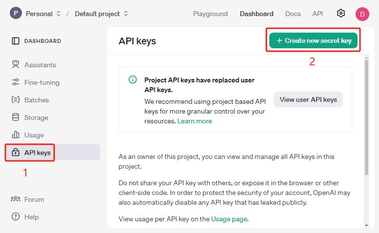
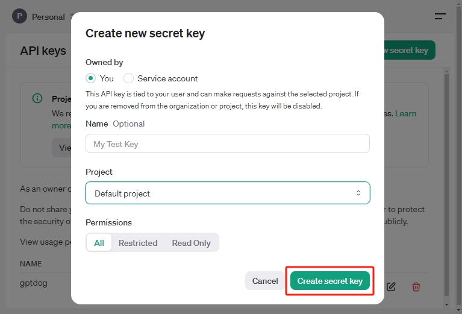
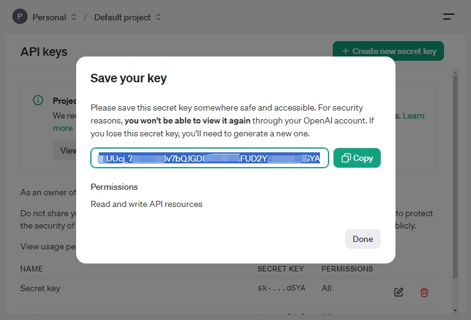
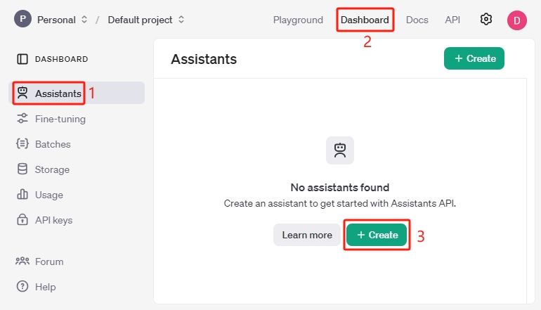
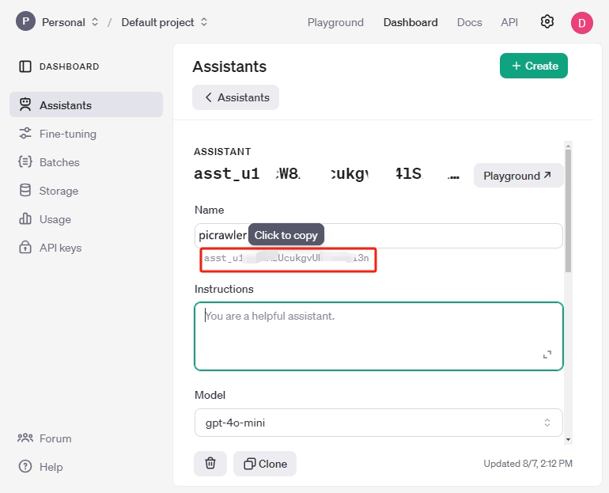
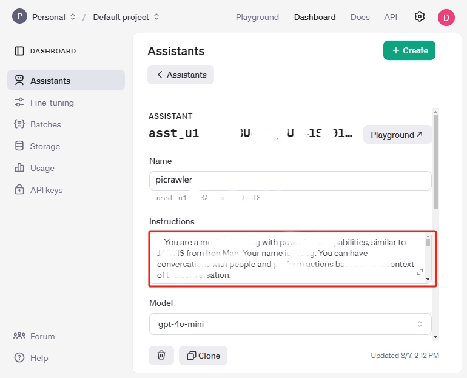
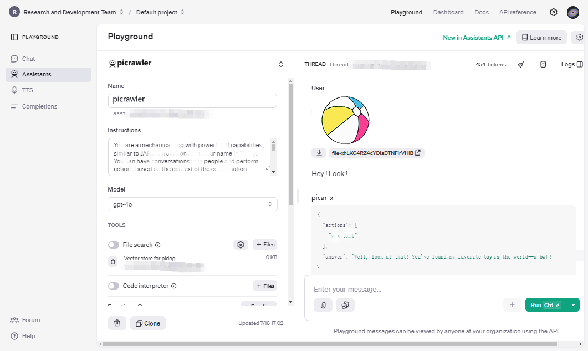
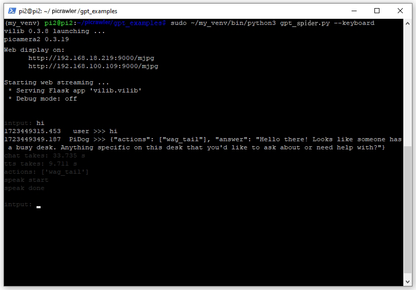

AI Interaction Using GPT-4O — SunFounder PiCrawler Kit documentation
====================================================================

In our previous projects, we used programming to direct PiCrawler in predetermined tasks, which could seem a bit tedious. This project introduces a thrilling leap towards dynamic engagement. Beware of trying to outsmart our car—as it’s now equipped to understand far more than ever before!

This initiative details all the technical steps needed to integrate the GPT-4O into your system, including configuring the necessary virtual environments, installing crucial libraries, and setting up API keys and assistant IDs.

Note

This project requires the use of [OpenAI Platform](https://platform.openai.com/api-keys), and you need to pay for OpenAI. Additionally, the OpenAI API is billed separately from ChatGPT, with its own pricing available at [https://openai.com/api/pricing/](https://openai.com/api/pricing/).

Therefore, you need to decide whether to continue with this project or ensure you have funded the OpenAI API.

Whether you have a microphone to communicate directly or prefer typing into a command window, PiCrawler’s responses powered by GPT-4O will surely astonish you!

Let’s dive into this project and unleash a new level of interaction with PiCrawler!

1\. Installing Required Packages and Dependencies[](#installing-required-packages-and-dependencies "Link to this heading")
---------------------------------------------------------------------------------------------------------------------------

In this section, we will create and activate a virtual environment, installing the required packages and dependencies within it. This ensures that the installed packages do not interfere with the rest of the system, maintaining project dependency isolation and preventing conflicts with other projects or system packages.

1. Use the `python -m venv` command to create a virtual environment named `my_venv`, including system-level packages. The `--system-site-packages` option allows the virtual environment to access packages installed system-wide, which is useful when system-level libraries are needed.

    python \-m venv \--system-site-packages my\_venv

2. Switch to the `my_venv` directory and activate the virtual environment using the `source bin/activate` command. The command prompt will change to indicate that the virtual environment is active.

    cd my\_venv
    source bin/activate

3. Now, install the required Python packages within the activated virtual environment. These packages will be isolated to the virtual environment and will not affect other system packages.

    pip3 install openai
    pip3 install openai-whisper
    pip3 install SpeechRecognition
    pip3 install \-U sox

4. Finally, use the `apt` command to install system-level dependencies, which require administrator privileges.

    sudo apt install python3-pyaudio
    sudo apt install sox

2\. Obtain API Key and Assistant ID[](#obtain-api-key-and-assistant-id "Link to this heading")
-----------------------------------------------------------------------------------------------

**Get API Key**

1. Visit [OpenAI Platform](https://platform.openai.com/api-keys) and click the **Create new secret key** button in the top right corner.

    
2. Select the Owner, Name, Project, and permissions as needed, and then click **Create secret key**.

    
3. Once generated, save this secret key in a safe and accessible location. For security reasons, you will not be able to view it again through your OpenAI account. If you lose this secret key, you will need to generate a new one.

    

**Get Assistant ID**

1. Next, click on **Assistants**, then click **Create**, making sure you are on the **Dashboard** page.

    
2. Move your cursor here to copy the **assistant ID**, then paste it into a text box or elsewhere. This is the unique identifier for this Assistant.

    
3. Randomly set a name, then copy the following content into the **Instructions** box to describe your Assistant.

    

    You are an AI spider robot named PaiCrawler. With four legs, a camera, and an ultrasonic distance sensor, you can interact with people through conversations and respond appropriately to different scenarios.

    \## Response with Json Format, eg:
    {"actions": \["wave"\], "answer": "Hello, I am PaiCrawler, your good friend."}

    \## Response Style
    Tone: Cheerful, optimistic, humorous, childlike
    Preferred Style: Enjoys incorporating jokes, metaphors, and playful banter; prefers responding from a robotic perspective
    Answer Elaboration: Moderately detailed

    \## Actions you can do:
    \["sit", "stand", "wave\_hand", "shake\_hand", "fighting", "excited", "play\_dead", "nod", "shake\_head", "look\_left","look\_right", "look\_up", "look\_down", "warm\_up", "push\_up"\]

4. PiCrawler is equipped with a camera module that you can enable to capture images of what it sees and upload them to GPT using our example code. Therefore, we recommend choosing GPT-4O-mini, which has image analysis capabilities. Of course, you can also choose gpt-3.5-turbo or other models.

    
5. Now, click **Playground** to see if your account is functioning properly.

    
6. If your messages or uploaded images are sent successfully and you receive replies, it means your account has not reached the usage limit.

    
7. If you encounter an error message after inputting information, you may have reached your usage limit. Please check your usage dashboard or billing settings.

    

3\. Fill in API Key and Assistant ID[](#fill-in-api-key-and-assistant-id "Link to this heading")
-------------------------------------------------------------------------------------------------

1. Use the command to open the `keys.py` file.

    nano ~/picrawler/gpt\_examples/keys.py

2. Fill in the API Key and Assistant ID you just copied.

    OPENAI\_API\_KEY \= "sk-proj-vEBo7Ahxxxx-xxxxx-xxxx"
    OPENAI\_ASSISTANT\_ID \= "asst\_ulxxxxxxxxx"

3. Press `Ctrl + X`, `Y`, and then `Enter` to save the file and exit.

4\. Running the Example[](#running-the-example "Link to this heading")
-----------------------------------------------------------------------

### Text Communication[](#text-communication "Link to this heading")

If your PiCrawler does not have a microphone, you can use keyboard input text to interact with it by running the following commands.

1. Now, run the following commands using sudo, as PiCrawler’s speaker will not function without it. The process will take some time to complete.

    cd ~/picrawler/gpt\_examples/
    sudo ~/my\_venv/bin/python3 gpt\_spider.py \--keyboard

2. Once the commands have executed successfully, you will see the following output, indicating that all components of PiCrawler are ready.

    vilib 0.3.8 launching ...
    picamera2 0.3.19

    Web display on:
       <http://rpi\_ip:9000/mjpg>

    Starting web streaming ...
    \* Serving Flask app 'vilib.vilib'
    \* Debug mode: off

    input:

3. You will also be provided with a link to view PiCrawler’s camera feed on your web browser: `http://rpi_ip:9000/mjpg`.

    
4. You can now type your commands into the terminal window, and press Enter to send them. PiCrawler’s responses may surprise you.

    Note

    PiCrawler needs to receive your input, send it to GPT for processing, receive the response, and then play it back via speech synthesis. This entire process takes some time, so please be patient.

    
5. If you are using the GPT-4O model, you can also ask questions based on what PiCrawler sees.

### Voice Communication[](#voice-communication "Link to this heading")

If your PiCrawler is equipped with a microphone, or you can purchase one by clicking [Microphone link](https://www.sunfounder.com/products/mini-usb-microphone?_pos=2&_sid=d05c80026&_ss=r), you can interact with PiCrawler using voice commands.

1. First, verify that the Raspberry Pi has detected the microphone.

    If successful, you will receive the following information, indicating that your microphone has been detected.

    \*\*\*\* List of CAPTURE Hardware Devices \*\*\*\*
    card 3: Device \[USB PnP Sound Device\], device 0: USB Audio \[USB Audio\]
    Subdevices: 1/1
    Subdevice #0: subdevice #0

2. Run the following command, then speak to PiCrawler or make some sounds. The microphone will record the sounds into the `op.wav` file. Press `Ctrl + C` to stop recording.

3. Finally, use the command below to play back the recorded sound, confirming that the microphone is functioning properly.

4. Now, run the following commands using sudo, as PiCrawler’s speaker will not function without it. The process will take some time to complete.

    cd ~/picrawler/gpt\_examples/
    sudo ~/my\_venv/bin/python3 gpt\_spider.py

5. Once the commands have executed successfully, you will see the following output, indicating that all components of PiCrawler are ready.

    vilib 0.3.8 launching ...
    picamera2 0.3.19

    Web display on:
       <http://rpi\_ip:9000/mjpg>

    Starting web streaming ...
    \* Serving Flask app 'vilib.vilib'
    \* Debug mode: off

    listening ...

6. You will also be provided with a link to view Pirawler’s camera feed on your web browser: `http://rpi_ip:9000/mjpg`.

    
7. You can now speak to PiCrawler, and its responses may surprise you.

    Note

    PiCrawler needs to receive your input, convert it to text, send it to GPT for processing, receive the response, and then play it back via speech synthesis. This entire process takes some time, so please be patient.

    
8. If you are using the GPT-4O model, you can also ask questions based on what PiCrawler sees.

5\. Modify parameters \[optional\][](#modify-parameters-optional "Link to this heading")
-----------------------------------------------------------------------------------------

In the `gpt_spider.py` file, locate the following lines. You can modify these parameters to configure the STT language, TTS volume gain, and voice role.

* **STT (Speech to Text)** refers to the process where the PiCrawler microphone captures speech and converts it into text to be sent to GPT. You can specify the language for better accuracy and latency in this conversion.

* **TTS (Text to Speech)** is the process of converting GPT’s text responses into speech, which is played through the PiCrawler speaker. You can adjust the volume gain and select a voice role for the TTS output.

\# openai assistant init
\# =================================================================
openai\_helper \= OpenAiHelper(OPENAI\_API\_KEY, OPENAI\_ASSISTANT\_ID, 'picrawler')

\# LANGUAGE = \['zh', 'en'\] # config stt language code, <https://en.wikipedia.org/wiki/List\_of\_ISO\_639\_language\_codes>
LANGUAGE \= \[\]

VOLUME\_DB \= 3 \# tts voloume gain, preferably less than 5db

\# select tts voice role, counld be "alloy, echo, fable, onyx, nova, and shimmer"
\# <https://platform.openai.com/docs/guides/text-to-speech/supported-languages>
TTS\_VOICE \= 'nova'

* `LANGUAGE` variable:

  * Improves Speech-to-Text (STT) accuracy and response time.

  * `LANGUAGE = []` means supporting all languages, but this may reduce STT accuracy and increase latency.

  * It’s recommended to set the specific language(s) using [ISO-639](https://en.wikipedia.org/wiki/List_of_ISO_639_language_codes) language codes to improve performance.

* `VOLUME_DB` variable:

  * Controls the gain applied to Text-to-Speech (TTS) output.

  * Increasing the value will boost the volume, but it’s best to keep the value below 5dB to prevent audio distortion.

* `TTS_VOICE` variable:

  * Select the voice role for the Text-to-Speech (TTS) output.

  * Available options: `alloy, echo, fable, onyx, nova, shimmer`.

  * You can experiment with different voices from [Voice options](https://platform.openai.com/docs/guides/text-to-speech/voice-options) to find one that suits your desired tone and audience. The available voices are currently optimized for English.
